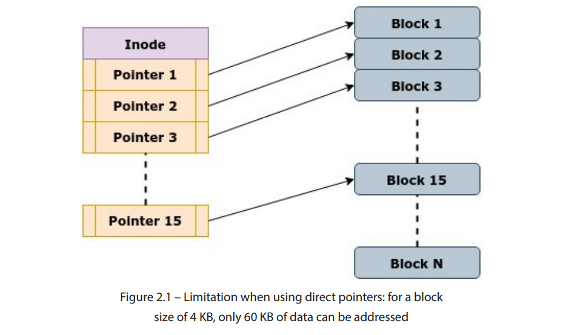
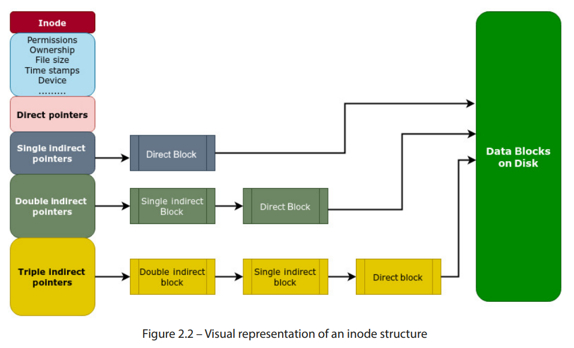
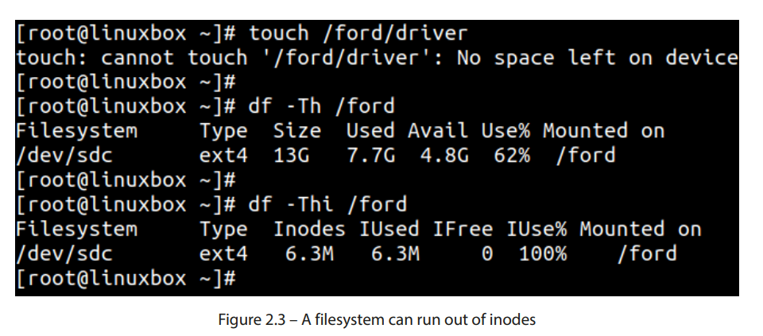

# 虚拟文件系统的数据结构

在本书的第一章中，我们详细介绍了虚拟文件系统（VFS），它最常见的功能、为何它是必要的以及它如何在实现 Linux 中的一切皆文件概念中发挥关键作用。我们还解释了 Linux 中的系统调用接口，以及用户空间应用程序如何使用通用系统调用与 VFS 进行交互。VFS 位于用户空间程序和实际文件系统之间，实施了一个通用的文件模型，使得应用程序能够使用统一的访问方式来执行操作，无论使用的是哪种文件系统。

在讨论不同的文件系统时，我们提到过 VFS 使用诸如 inode、超级块和目录项等结构来表示文件系统的通用视图。这些结构至关重要，因为它们确保了文件的元数据与实际数据之间的清晰区分。

本章将介绍内核 VFS 中的不同数据结构。你将了解内核如何使用诸如 inode 和目录项等结构来存储文件的元数据。你还将学习内核如何通过超级块结构记录文件系统的特性。最后，我们将解释 VFS 中的缓存机制。

我们将涵盖以下主要内容：
- inode
- 超级块
- 目录项
- 文件对象
- 页面缓存

### 技术要求
拥有一定的 Linux 操作系统概念的理解会非常有帮助。这包括对文件系统、进程和内存管理的知识。本书不会创建任何新代码，但如果你想更深入地探索 Linux 内核，理解 C 编程概念对于理解 VFS 数据结构至关重要。作为一般规则，你应该养成查阅官方内核文档的习惯，因为它能提供有关内核内部工作机制的深入信息。

本章中介绍的命令和示例与发行版无关，可以在任何 Linux 操作系统上运行，例如 Debian、Ubuntu、Red Hat、Fedora 等等。文中有一些涉及内核源代码的参考。如果你想下载内核源代码，可以从www.kernel.org下载。本章和本书中提到的代码段来自内核 5.19.9。


##  VFS 中的数据结构
VFS 使用多种数据结构来实现所有文件系统的通用抽象方法，并为用户空间程序提供文件系统接口。这些结构确保了文件系统设计和操作的某种共通性。要记住的一个重要点是，VFS 定义的所有方法并不一定适用于所有文件系统。是的，文件系统应遵循 VFS 中定义的结构，并在此基础上建立以确保它们之间的共通性。但是，在某些情况下，这些结构中可能有许多方法和字段对于特定文件系统是不适用的。在这种情况下，文件系统会根据其设计坚持使用相关字段，并且放弃多余的信息。因为我们将要解释常见的 VFS 数据结构，所以有必要查看内核中的相关代码片段以便澄清一些问题。尽管如此，我已尽力以一种通用的方式呈现材料，以便大多数概念即使没有开发对代码的理解也能被理解。

古希腊人相信四大元素构成了一切：土、水、空气和火。同样，以下结构构成了 VFS 的大部分内容：
- 索引节点
- 目录条目
- 文件对象
- 超级块

### Inodes – 索引文件和目录

在磁盘上存储数据时，Linux 遵循一个严格的规则：封装之外的所有信息必须与封装内部的内容分开存放。换句话说，描述文件的数据与文件中实际数据是隔离的。保存这些元数据的结构称为索引节点，简称inode。inode 结构包含 Linux 中文件和目录的元数据。文件或目录的名称仅是指向 inode 的指针，并且每个文件或目录恰好有一个 inode。

把“魔法地图”作为一个类比来考虑（哈利·波特，有人认为？）。地图显示了学校每个人的位置。每个人在地图上由一个点表示，当你点击这个点时，它会显示关于这个人的信息，如他们的姓名、位置和状态。把“魔法地图”想象成文件系统，把点代表的人想象成显示元数据的 inode。

但是，文件的元数据包括什么呢？当你通过ls命令简单列出文件时，你会看到许多信息，例如文件权限、所有权、时间戳等。所有这些细节构成了文件的元数据，它们描述了文件的某些属性，而不是其实际内容。

通过简单的ls命令可以检查一些文件元数据。尽管显示文件元数据的更好的命令是stat，因为它提供了关于文件属性的更多信息。例如，它显示访问、修改、更改时间戳，文件所在设备，驱动器上为文件保留的块数，以及文件的索引节点号。

如果要获取关于文件元数据的详细信息，如 /etc/hosts，我们可以使用以下 stat 命令：
```
stat /etc/hosts
注意 /etc/hosts 的索引节点号（67118958）在 stat 命令的输出中：

[root@linuxbox ~]# stat /etc/hosts
  File: /etc/hosts
  Size: 220             Blocks: 8          IO Block: 4096   regular file
Device: fd00h/64768d    Inode: 67118958    Links: 1
Access: (0644/-rw-r--r--)  Uid: (    0/    root)   Gid: (    0/    root)
Access: 2022-11-20 04:00:38.054988422 -0500
Modify: 2022-06-15 22:30:32.755324938 -0400
Change: 2022-06-15 22:30:32.755324938 -0400
Birth: 2022-06-15 22:30:32.755324938 -0400
[root@linuxbox ~]#
```
文件的索引节点号（inode number）作为文件的唯一标识符。例如，find 命令提供 inum 参数来通过索引节点号搜索文件：
```
find / -inum 67118958 -exec ls -l {} \;
```
如果我们通过 stat 命令检索到索引节点号，然后通过find可以检索到相应的文件：
```
[root@linuxbox ~]# find / -inum 67118958 -exec ls -l {} \;
-rw-r--r-- 1 root root 220 Jun 15 22:30 /etc/hosts
[root@linuxbox ~]#
```
索引节点号仅在文件系统边界内唯一。如果系统上的目录（如 /home 和 /tmp）位于不同的磁盘分区和文件系统上，则同一索引节点号可能分配给每个文件系统中的不同文件：
```
[root@linuxbox ~]# ls -li /home/pokemon/pikachu 
134460858 -rw-r--r-- 1 root root 1472 Oct 11 05:10 /home/pokemon/pikachu
[root@linuxbox ~]# 
[root@linuxbox ~]# ls -li /tmp/bulbasaur
134460858 -rw-r--r-- 1 root root 259 Nov 20 04:36 /tmp/bulbasaur
[root@linuxbox ~]#
```
索引节点号在文件系统边界内的唯一性与 链接 的概念相关联。由于同一索引节点号可能由不同的文件系统使用，硬链接不跨文件系统边界。

### Inode在内核中的定义

在内核的源代码中，索引节点的定义在文件linux/fs.h中。这个定义中有很多个字段，注意inode结构体的定义是通用的且包罗万象。索引节点是特定于文件系统的属性。文件系统不必在其索引节点定义中定义所有这些字段。索引节点结构的定义相当长，因此我们将限制到一些基本字段：
```
struct inode {
        umode_t                 i_mode;
        unsigned short          i_opflags;
        kuid_t                  i_uid;
        kgid_t                  i_gid;
        unsigned int            i_flags;
        const struct inode_operations   *i_op;
        struct super_block      *i_sb;
[………………………...]
```

以下是一些定义：

- i_mapping：这是一个指针，指向保存索引节点数据块映射的地址空间结构。当创建索引节点或从磁盘读取时，文件系统会初始化此字段。例如，当进程向文件写入数据时，内核使用此字段将适当的内存页面映射到文件的数据块中。（数据块在下一节中有解释。）

- i_uid 和 i_gid：分别是用户和组的所有者。

- i_flags：这定义了特定于文件系统的标志。

- i_acl：这是用于文件系统访问控制列表的字段。

- i_op：这指向索引节点操作结构，定义了可以对索引节点执行的所有操作，如创建、读取、写入和修改文件属性。

- i_sb：这指向包含索引节点所在的底层文件系统的超级块结构。（有一个单独的主题来解释超级块结构。）

- i_rdev：此字段存储某些特殊文件的设备号。例如，内核为系统中的硬盘和其他设备创建特殊文件。创建特殊文件时，内核为其分配唯一的设备号，创建设备的索引节点，并将此字段设置为指向设备的标识符。

- i_atime、i_mtime 和 i_ctime：分别是访问时间、修改时间和更改时间戳。

- i_bytes：文件中的字节数。

- i_blkbits：此字段存储表示 inode 所属文件系统块大小所需的位数。

- i_blocks：此字段存储 inode 所表示的文件使用的磁盘块的总数。

- i_fop：这是指向与 inode 关联的文件操作结构的指针。例如，当进程打开文件时，内核使用这个字段获取该文件的文件操作结构的指针。然后它可以使用文件操作结构中定义的函数来对文件进行操作，比如读取或写入。

- i_count：用于跟踪指向 inode 的活动引用次数。每当一个新进程访问一个文件时，这个计数器就会为该文件递增。如果这个字段的值为零，意味着没有更多的引用指向该 inode，此时可以安全地释放它。

- i_nlink：此字段引用指向该 inode 的硬链接数量。

- i_io_list：这是一个用于跟踪有待处理 I/O 请求的 inode 的列表。当内核将 I/O 请求添加到某个 inode 的队列时，该 inode 会被添加到这个列表中。当 I/O 请求完成后，inode 会从该列表中移除。

在 inode 结构的定义中大约有 50 个字段，因此我们这里只是略微触及了表面。但这应该可以让我们了解到，inode 定义的内容远不止文件的表层信息。如果你感到困惑，不用担心，我们会详细解释 inode。对于 inode 结构，有两种操作类型，它们分别由file_operations和inode_operations结构定义。稍后我们会在文件对象 – 代表已打开文件部分中稍微介绍一下file_operations结构。

### 定义Inode Operations结构

这个inode operation 定义了一系列文件系统如何和inode交互的函数指针。每一个文件系统有他自己的inode operations 结构体，inode_operations结构由i_op指针引用。还记得我们在第一章中解释的一切皆文件概念吗？一切皆文件，虽然是不同类型的文件，因此每个文件都会分配一个 inode。磁盘驱动器、磁盘分区、常规文本文件、文档、管道和套接字都有一个 inode。每个目录也有一个 inode。但所有这些文件的性质不同，并且在你的系统中代表不同的实体。例如，适用于目录的 inode 操作与常规文本文件不同。inode_operations结构提供了每种类型文件需要实现的所有函数，用于管理 inode 数据。

每个 inode 都与inode_operations结构的一个实例相关联，该结构提供了一组可以对 inode 执行的操作。该结构包含指向不同函数的指针，这些函数用于操作 inode：
```
struct inode_operations {
        struct dentry * (*lookup) (struct inode *,struct dentry *, unsigned int);
        const char * (*get_link) (struct dentry *, struct inode *, struct delayed_call *);
        int (*permission) (struct user_namespace *, struct inode *, int);
        struct posix_acl * (*get_acl)(struct inode *, int, bool);
        int (*readlink) (struct dentry *, char __user *,int);
        int (*create) (struct user_namespace *, struct inode *,struct dentry *, umode_t, bool);
        int (*link) (struct dentry *,struct inode *,struct dentry *);
        int (*unlink) (struct inode *,struct dentry *);
        int (*symlink) (struct user_namespace *, struct inode *,struct dentry *,
[……………………………………….]
```

一些可以通过该结构执行的重要操作在这里描述：

- lookup：用于在目录中查找 inode 条目。它接受一个目录 inode 和文件名作为参数，返回一个指向与文件名对应的 inode 的指针。

- create：当创建新文件或目录时调用此函数，它负责使用适当的元数据（如所有权和权限）初始化 inode。这用于响应open ()系统调用时构建 inode 对象。

- get_link：用于操作符号链接。符号链接指向另一个 inode。

- permission：当文件需要访问时，VFS 调用此函数来检查文件的访问权限。

- link：这是响应link ()系统调用时调用的，它创建一个新的硬链接。它增加了 inode 的链接计数，并更新了其元数据。

- symlink：这是响应symlink ()系统调用时调用的，它创建一个新的软链接。

- unlink：这是响应unlink ()系统调用时调用的，用于删除文件链接。它减少 inode 的链接计数，并在链接计数为零时从磁盘中删除 inode。

- mkdir 和 rmdir：这些是响应mkdir ()和rmdir ()系统调用时分别用于创建和删除目录的函数。


### 通过inode来跟踪磁盘数据

文件系统中的每一个文件都有相同的元数据，也都有一个inode和其关联。由于每个inode都存储了一些信息，文件系统需要为它们保留一些空间，通常只是几个字节。例如一个ext4文件系统有256个字节来保存inode.文件系统通过 inode table来跟踪使用的和未使用的inode。

inode结构中包含的字段为文件提供了以下两类信息：

- 文件属性：有关文件所有权、权限、时间戳、链接和使用的块数的详细信息。

- 数据块：指向磁盘上的数据块，实际文件内容存储的位置。

除了文件权限、所有权和时间戳外，inode 提供的另一个重要信息是实际数据在磁盘上的位置。文件的大小决定了它可能跨越多个磁盘块。inode 结构使用指针来追踪这些信息。为什么需要这样做呢？因为没有保证文件中的数据会以顺序或连续的方式存储和访问。inode 使用的指针通常为 4 字节大小，可以分为直接指针和间接指针。对于较小的文件，inode 包含指向文件数据块的直接指针。每个直接指针指向存储文件数据的磁盘地址。

使用直接指针来引用磁盘地址注定会有一个主要的局限性。问题是：多少个直接指针足够？文件大小可以从几个字节到几太字节不等。在结构中使用 15 个直接指针意味着，对于 4 KB 的块大小，我们最多只能指向 60 KB 的数据。当然，这在任何维度上都行不通，因为即使是小的文本文件也通常大于 60 KB。这在图 2.1中得到了展示：



图 2.1 – 使用直接指针时的限制：对于 4 KB 的块大小，仅能寻址 60 KB 的数据

为了解决这个问题，使用了间接指针。一个 inode 结构包含 12 个直接指针和 3 个间接指针。与直接指针不同，间接指针是指向指针块的指针。当所有直接指针用尽时，文件系统使用数据块来存储额外的指针。inode 中的倒霉的第 13 个或者单间接指针指向这个数据块。这个块中的指针指向实际包含文件数据的数据块。当文件大小无法通过单间接指针寻址时，就会使用双间接指针。双间接指针指向一个包含指向间接块的指针的块，每个间接块包含指向磁盘地址的指针。类似地，当文件的大小超出双间接指针的限制时——是的，你猜对了——三重间接指针被使用。

到这个时候，你可能已经头晕眼花，觉得根本没有意义（指针）。不用说，这整个层次结构相当复杂。一些现代文件系统利用了一种叫做范围（extents）的概念来存储更大的文件。我们将在讨论块文件系统时详细讲解这个概念，具体内容会在第三章，探索 VFS 下的实际文件系统中介绍。

现在，让我们简化这一点，并为自己指明正确的方向。我们将利用一些基础数学来解释间接指针如何帮助存储更大的文件。我们将考虑 4 KB 的块大小，因为这是大多数文件系统的默认设置：

- 一个 inode 中的总指针数量 = 15

- 直接指针的数量 = 12

- 间接指针的数量 = 1

- 双重间接指针的数量 = 1

- 三重间接指针的数量 = 1

- 每个指针的大小（直接或间接）= 4 字节

- 每个块的指针数量 = （块大小）/（指针大小）= （4 KB / 4）= 1,024 个指针

- 使用直接指针可以引用的最大文件大小 = 12 x 4 KB = 48 KB

- 使用 12 个直接指针和 1 个间接指针可以引用的最大文件大小 = [(12 x 4 KB) + (1,024 x 4 KB)] ≈ 4 MB

- 使用 12 个直接指针、1 个间接指针和 1 个双级间接指针可以引用的最大文件大小 = [(12 x 4 KB) + (1,024 x 4 KB) + (1,024 x 1,024 x 4 KB)] ≈ 4 GB

- 使用 12 个直接指针、1 个单级间接指针、1 个双级间接指针和 1 个三级间接指针可以引用的最大文件大小 = （12 x 4 KB）+ （1,024 x 4 KB）+ （1,024 x 1,024 x 4 KB）+ （1 x 1,024 x 1,024 x 1,024 x 4 KB）≈ 4 TB

以下图示展示了如何通过使用间接指针来帮助处理更大的文件：


图 2.2 – inode 结构的可视化表示

如图 2.2所示，文件系统可能会为较小的文件使用单级间接块，然后对于较大的文件切换到双级间接块。使用间接 inode 指针有多个优点。首先，它消除了为了容纳大文件而需要连续存储分配的需求，从而使文件系统能够有效地处理这些文件。其次，它有助于高效的空间利用，因为可以根据需要为文件分配块，而不是预先保留大量空间。每个 inode 通常有 12 个直接块指针，1 个单级间接块指针，1 个双级间接块指针和 1 个三级间接块指针。

### 文件系统会耗尽 inode 吗？

在管理存储时，保持空间可用是一个主要关注点。磁盘空间耗尽是常见的情况。每个文件和目录都分配了一个 inode，但如果所有的 inode 都已分配了怎么办？这不太可能发生，因为文件系统通常有数百万个可用的 inode。但是，是的，文件系统确实有可能耗尽 inode。如果发生这种情况，磁盘上可用的空间将无济于事，因为文件系统将无法创建任何新文件。文件系统创建后，inode 的数量无法扩展，因此备份将是唯一的选择。你可以使用 df 命令检查已挂载文件系统的 inode 使用情况：
```
df -Thi
```
Figure 2**.3图示了这种情况。挂载在/ford上的文件系统有接近 40%的剩余空间，但由于已经耗尽了 630 万个索引节点，无法创建任何新文件。



让我们用几个关键的索引节点指针来总结我们的讨论：

- 除了元数据外，索引节点还保存文件在物理磁盘上存储位置的信息。为了追踪文件的物理位置，索引节点使用多个直接和间接指针。

- 索引节点存储在磁盘上的文件系统结构中的索引节点表中。当需要打开一个文件时，相应的索引节点被加载到内存中。

- 对于仅在内存中生成其内容的文件系统（如procfs和sysfs），它们的索引节点仅存在于内存中。

- 虽然索引节点存储了关于文件的大量元数据，但它们不存储文件的名称。因此，索引节点结构中不包括文件内容和文件名。

- 索引节点使用 15 个指针来追踪文件在磁盘上的数据块。前 12 个指针是直接指针，只能寻址最大 48 KB 的文件大小。剩余的三个指针提供单一、双重和三重间接。通过使用这些间接指针，可以寻址大文件。

- 如果文件系统的索引节点用完，就无法在其上创建新文件。这种情况非常罕见，因为文件系统通常拥有数量庞大的索引节点，数量可达数百万。