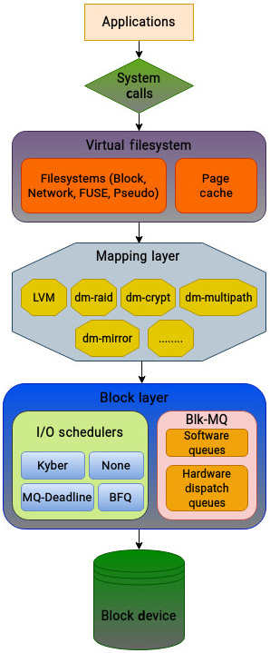
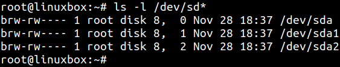
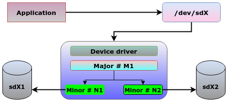

# 理解块层、块设备和数据结构

### 技术要求

Linux 内核的块层是一个相对复杂的话题。若你已经理解前 3 章（VFS 与文件系统）内容，会更容易把握块层和文件系统之间的交互关系。具备 C 语言基础会帮助你阅读本章引用的内核代码；同时，具备 Linux 系统实践经验也能显著提升理解效率。  
如果你想下载内核源码，可从 <https://www.kernel.org> 获取。本章与全书中的代码片段基于内核 `5.19.9`。

## 解释块层的角色

块层（block layer）的核心职责，是实现一组内核接口，让文件系统能够访问存储设备。应用访问物理存储时通常通过块设备进行，而这些数据请求由块层统一管理。  
在块层之上，内核还有一个映射层（mapping layer），可把一个块设备映射到另一个块设备之上，从而支持快照、加密、跨多物理设备的逻辑卷等能力。  
因此，块层接口是 Linux 持久化存储管理的关键基础。

和 VFS 一样，“抽象”是块层的核心价值：

- VFS 让应用用统一系统调用访问不同文件系统。
- 块层让上层以统一方式访问不同后端存储介质，而无需关心具体硬件类型。

下图展示了从 VFS 到块层的 I/O 层次结构：



块层的重要功能可以概括为：

- 向上：为文件系统提供统一入口，访问多种存储设备。  
- 向下：为驱动和设备提供统一入口，承接来自上层的 I/O 请求。
- 通过一组复杂结构进行通用化处理，其中最关键的是 `bio`。文件系统会构造 `bio` 来表示 I/O，再下发到块层并最终到驱动。
- 映射层通常通过 Device Mapper 实现，支撑 LVM、多路径、thin provisioning、加密、软件 RAID 等能力。
- 现代内核引入了 `blk-mq`（multi-queue）框架，为每个 CPU 隔离软件队列并对接硬件分发队列，显著改善并行 I/O 性能（下一章详述）。
- 块层还包含 I/O 调度器（如 `mq-deadline`、`kyber`、`bfq`），并实现错误处理与 I/O 统计等能力。

块层的中心对象是块设备。除了磁带这类流式设备，大多数常见存储（机械盘、SSD、闪存设备）都属于块设备。

## 定义块设备

内核和外设交换数据主要有两类方式：

- 字符设备（character device）：一次处理一个字符，顺序访问，管理相对简单（如键盘、串口、文本终端）。
- 块设备（block device）：按固定大小块处理数据，支持随机访问，适合大规模数据读写（如 HDD/SSD/U 盘/CD-ROM）。

当数据量很大时，一次一个字符的方式明显不可行；块设备按固定块处理、支持寻址跳转，因此性能和适用范围都更强，但内核管理复杂度也更高。

块设备也可以在内存中存在（ramdisk）。常见场景是 Linux 启动阶段的 `initrd`，用于临时根文件系统。  
但 RAM 是易失介质，断电后数据丢失，因此本书后续讨论中，“块设备”通常指持久化存储介质。

### “块”在不同层次的含义

内核 I/O 栈不同层次对“块”的粒度定义不同：

- 用户态应用：通过系统调用读写的那段数据大小（应用自定义）。
- 页缓存（page cache）：基本传输单位是页，常见为 `4 KB`。
- 文件系统层：文件系统按其配置块大小做 I/O（常见 `512 B` 到 `4 KB`，有些可更大）。
- 物理存储层：最小可寻址单位通常是扇区（sector），常见 `512 B`（也有 4K 扇区）。

要特别注意：文件系统 block 不是块层 I/O 的最小单位。块层里最基础的单位是 sector。  
内核中大量结构使用 `sector_t` 表示地址或偏移（以 512 字节为倍数）。

### 块设备的典型特性

- 随机访问（Random Access）：可在不同位置间跳转。
- 固定块传输：按固定大小块读写。
- 可堆叠（Stackability）：可通过 Device Mapper 叠加构建逻辑设备。
- 缓冲 I/O：大量依赖页缓存，写入先落缓存，之后刷盘。
- 可分区/可建文件系统：可切分为多个逻辑分区并分别建文件系统。
- 请求队列：通过 request queue 管理待处理 I/O。

## 在 Linux 中的表示

和 VFS 一样，块层的前提也是抽象统一。无论硬件型号如何，内核都应能通过统一接口处理。  
按照 Linux “一切皆文件”的理念，块设备在系统中表现为特殊文件，位于 `/dev` 目录。

例如：

- `sda`：第一块 SCSI/SATA 类型磁盘（或同类命名体系）
- `sda1`：`sda` 上的第一个分区

你可以用 `ls -l /dev/sd*` 或 `lsblk` 查看设备：



在时间戳前会看到两组数字（以逗号分隔），这就是设备的主次设备号：

- major number：标识使用哪个驱动
- minor number：区分该驱动管理下的具体设备或分区实例

例如 `sda`、`sda1`、`sda2` 可以共享 major `8`，而 minor 分别是 `0/1/2`。



当程序访问 `/dev` 下的设备文件时，内核先用 major 找到驱动，再用 minor 找到具体实例。

## 观察块层核心数据结构

管理块设备比管理字符设备复杂得多：要处理队列、调度、随机访问、吞吐与延迟平衡等问题。  
这使得块层成为 Linux 内核中最复杂的子系统之一。下面聚焦本章最关键的一组结构：

- `register_blkdev`
- `block_device`
- `gendisk`
- `buffer_head`
- `bio`
- `bio_vec`
- `request`
- `request_queue`

### register_blkdev（块设备注册）

块设备在可用之前，必须先向内核注册。核心入口为 `register_blkdev()`（宏转发到 `__register_blkdev`）：

```c
int __register_blkdev(unsigned int major, const char *name,
                      void (*probe)(dev_t devt))
```

它做的关键事情包括：

- 从动态分配池申请 major number。
- 创建并初始化对应的驱动表示结构（含驱动名、major、操作函数指针等）。
- 建立块层与该驱动之间的必要关联。

可以把它看作“驱动向块层报到”的标准入口。

### block_device（块设备实例）

`block_device` 定义在 `include/linux/blk_types.h`，用于表示“某个块设备实例”（可能是整盘，也可能是某个分区）：

```c
struct block_device {
        sector_t                    bd_start_sect;
        sector_t                    bd_nr_sectors;
        struct disk_stats __percpu *bd_stats;
        unsigned long               bd_stamp;
        bool                        bd_read_only;
        dev_t                       bd_dev;
        atomic_t                    bd_openers;
        struct inode               *bd_inode;
        ...
};
```

要点：

- 打开设备文件时，会创建对应 `block_device` 实例。
- 分区场景可通过字段（如 `bd_partno`）区分具体分区。
- 块设备的 inode 属于 `bdev` 虚拟文件系统。
- 结构中会保存设备大小、起始扇区、只读属性等信息，并关联 `gendisk` 与请求队列。

### gendisk（物理磁盘抽象）

`gendisk` 定义在 `include/linux/blkdev.h`，表示“物理磁盘这一整体对象”：

```c
struct gendisk {
        int major;
        int first_minor;
        int minors;
        char disk_name[DISK_NAME_LEN];
        unsigned short events;
        unsigned short event_flags;
        ...
};
```

它可以理解为连接“文件系统/块层接口”和“硬件接口”的桥梁：

- 一个整盘会有一个主 `block_device` 与 `gendisk` 关联。
- 同时其分区也会有各自 `block_device` 实例。
- `gendisk` 由驱动分配和维护，再通过注册流程挂入内核。

常见字段：

- `major`：驱动主设备号
- `first_minor`：该设备分配 minor 的起始偏移
- `minors`：该盘可用 minor 总数
- `fops`：文件操作函数集
- `private_data`：驱动私有数据
- `queue`：对应请求队列（非常关键）
- `disk_name`：设备名称

### buffer_head（内存中的块）

块设备读写高度依赖页缓存。数据从盘读入或写回前，都会先进入内存缓冲。  
`buffer_head`（`include/linux/buffer_head.h`）就是“单个块在内存中的表示”：

```c
struct buffer_head {
        unsigned long b_state;
        struct buffer_head *b_this_page;
        struct page *b_page;
        sector_t b_blocknr;
        size_t b_size;
        ...
};
```

关键字段（节选）：

- `b_data`：数据缓冲区起始地址
- `b_size`：缓冲区大小
- `b_page`：所在内存页
- `b_blocknr`：逻辑块号
- `b_state`：缓冲区状态（如 `BH_Uptodate`、`BH_Dirty`）
- `b_count`：引用计数
- `b_bdev`：所属块设备
- `b_end_io`：I/O 完成回调

历史上（2.6 之前）`buffer_head` 还承担 I/O 容器角色，导致大 I/O 时内存开销很高。之后该角色被 `bio` 取代。

### bio（活动中的块 I/O）

由于 `buffer_head` 作为 I/O 容器存在局限，内核引入 `bio` 来表示正在进行的块 I/O。  
`bio` 自 2.5 起成为块层 I/O 的基础单位，定义在 `include/linux/blk_types.h`：

```c
struct bio {
        struct bio          *bi_next;
        struct block_device *bi_bdev;
        unsigned int         bi_opf;
        ...
        unsigned short       bi_max_vecs;
        atomic_t             __bi_cnt;
        struct bio_vec      *bi_io_vec;
        ...
};
```

关键字段（节选）：

- `bi_next`：链到下一个 `bio`（一个请求可能拆成多个 `bio`）
- `bi_vcnt`：本次 I/O 包含的 `bio_vec` 数量
- `bi_io_vec`：`bio_vec` 数组指针，描述数据缓冲区位置/长度
- `bi_end_io`：I/O 完成回调
- `bi_private`：私有上下文
- `bi_opf`：I/O 选项和标记（如同步、缓存控制等）

流程上，文件系统会把请求翻译成一个或多个 `bio`，再通过 `submit_bio()` 下发到块层并进入请求队列。  
`submit_bio()` 提交后通常异步返回，不阻塞等待 I/O 完成。

### bio_vec（向量 I/O / scatter-gather）

`bio_vec` 定义在 `include/linux/bvec.h`：

```c
struct bio_vec {
        struct page *bv_page;
        unsigned int bv_len;
        unsigned int bv_offset;
};
```

字段含义：

- `bv_page`：数据所在页
- `bv_offset`：数据在页内偏移
- `bv_len`：数据长度

它用于描述散聚（scatter-gather）I/O：  
数据可分散在多个非连续内存缓冲区，块层以一个 `bio` 挂多个 `bio_vec` 来统一表达。

### request 与 request_queue（待处理 I/O）

当 I/O 提交到块层后，会创建 `request` 并进入 `request_queue`。  
它们定义在 `include/linux/blk-mq.h` 与 `include/linux/blkdev.h`。

```c
struct request {
        struct request_queue *q;
        struct blk_mq_ctx    *mq_ctx;
        struct blk_mq_hw_ctx *mq_hctx;
        ...
};
```

`request` 关键字段（节选）：

- `q`：所属请求队列
- `mq_ctx`：CPU 维度的软件队列上下文
- `mq_hctx`：硬件队列上下文
- `queuelist`：等待处理的请求链表
- `rq_next`：队列中的下一个请求
- `sector`：I/O 起始扇区
- `bio` / `biotail`：关联 `bio` 链表的头尾

`request_queue` 关键字段（节选）：

- `last_merge`：最近一次可合并请求
- `elevator`：I/O 调度器
- `q_usage_counter`：队列引用计数（per-CPU）
- `rq_qos`：请求 QoS 控制
- `mq_ops`：多队列操作函数集
- `disk`：关联的 `gendisk`

## 一次块 I/O 请求的旅程

下面先概括各结构扮演的角色：

| 结构 | 表示对象 | 作用简述 |
|---|---|---|
| `gendisk` | 物理磁盘 | 描述整盘属性（容量、几何参数等） |
| `block_device` | 块设备实例 | 描述具体设备/分区、主次号及其队列 |
| `buffer_head` | 内存中的块 | 跟踪读入或待写回的数据块 |
| `request` | I/O 请求 | 描述请求类型、起始扇区等 |
| `request_queue` | 请求队列 | 管理待处理请求及调度状态 |
| `bio` | 块 I/O | 高层 I/O 表示，可包含多个数据段 |
| `bio_vec` | 散聚缓冲段 | 描述单个数据缓冲区（页+偏移+长度） |

当进程发起 I/O 时，典型流程如下：

1. 应用在用户地址空间缓冲区写入数据。  
2. 块层构造 `buffer_head` 表示该数据块。  
3. 块层构造 `bio`，并把缓冲映射为一个或多个 `bio_vec`。  
4. `bio` 通过 `request` 进入目标设备的 `request_queue`。  
5. 对应驱动（通过 `register_blkdev` 注册）从队列取请求并调度。  
6. 根据设备约束，`bio` 可能进一步拆分为多个 `request`。  
7. 驱动把数据写入物理设备或从物理设备读取。  
8. I/O 完成后，驱动通知块层。  
9. 块层更新缓冲和相关结构，标记请求完成并唤醒等待进程。  
10. 对应 `buffer_head` 状态同步为最新。  

补充：旧内核的请求队列模型是单队列，难以发挥现代多核与高速设备能力。  
从 Linux `3.13` 开始引入 `blk-mq` 多队列框架，下一章会深入展开。

## 总结

本书第一部分（Chapter 1-3）讲 VFS 与文件系统；第二部分（Chapter 4-6）进入块层。  
本章完成了第二部分的起点：解释块层在内核中的角色，以及它如何管理块设备 I/O。

相比只能顺序访问的字符设备，块设备必须支持随机访问，并在性能上更敏感。  
因此，Linux 内核在块层实现了一整套复杂结构（`block_device`、`gendisk`、`bio`、`request_queue` 等）来组织、调度与执行 I/O。

下一章将在这些基础上继续展开：多队列模型（`blk-mq`）与 Device Mapper 如何协同处理块层请求。
