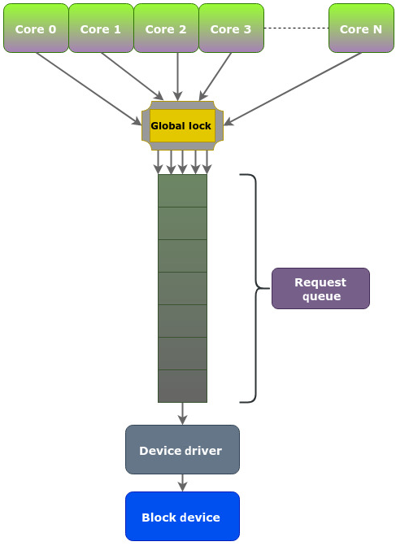
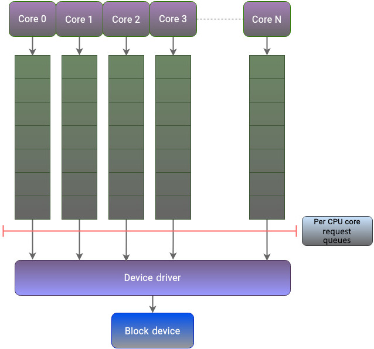
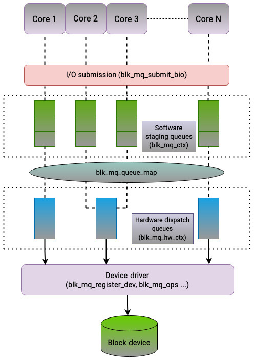
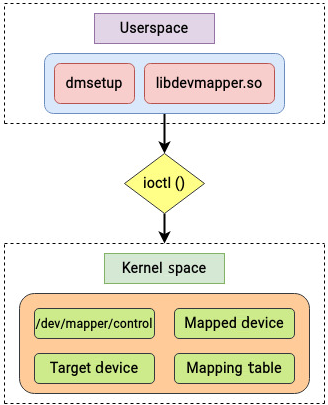
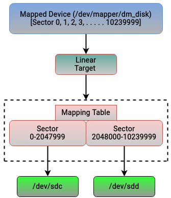
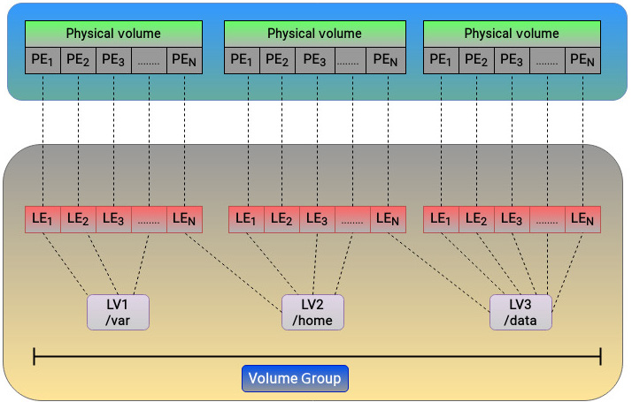

# 理解块层、多队列和 Device Mapper

本章将讨论以下主题：

- 单请求队列模型的问题
- 多队列块 I/O 机制（blk-mq）
- Device Mapper 框架
- 块层中的多层缓存机制

### 技术要求

除前几章提到的 Linux 基础外，本章还涉及现代处理器与存储设备的一些基本概念。若你有 Linux 存储管理实践经验，理解会更顺畅。  
本章命令和示例与发行版无关，可在 Debian、Ubuntu、Red Hat、Fedora 等系统上运行。  
若需要内核源码，可从 <https://www.kernel.org> 下载。书中代码片段基于 Linux 内核 `5.19.9`。

## 单请求队列模型的问题

操作系统需要尽可能发挥块设备性能。应用对块设备的 I/O 可能落在任意位置，这意味着频繁寻址。对机械盘来说，大量随机访问不但会拉低性能，还可能带来明显的寻道噪声。

早期块层设计主要面向机械盘时代，当时设备 IOPS 规模远低于今天。后来发生了两个关键变化：

- 多核处理器普及
- SSD / NVMe 等新型存储快速发展

瓶颈从物理硬件逐步转移到了内核软件层。

传统块层模型中，I/O 请求处理通常是下面两种方式之一：

- 通过单个请求队列（链表）排队，新的请求追加到队尾，随后执行合并/重排等处理再交给驱动。
- 某些场景直接绕过队列，把请求交给驱动，导致本可在队列阶段完成的优化转移到驱动侧，通常性能更差。

即便使用现代 SSD，单队列模型仍有三类核心问题：

- 锁竞争：多核共享一个请求队列，必须通过全局锁同步。一个核心持锁时，其他核心只能等待。
- 缓存一致性压力：每核缓存可能持有共享数据副本，更新传播与一致性维护引入额外开销。
- 中断增多：锁在核心间频繁切换，导致更多中断与上下文干扰。

结论是：核心数越高，围绕单队列锁的争用越严重，大量 CPU 周期被浪费在自旋等待上，尤其在多路 CPU 系统上会显著压低 IOPS。

图 5.1 展示了单队列模型的结构性瓶颈：



随着企业存储大规模转向 SSD 与非易失内存，设备本身已可并行处理大量请求，随机访问惩罚也显著降低。旧模型无法继续匹配硬件能力，块层必须演进。

## 理解多队列块 I/O 框架（blk-mq）

Linux 存储栈和网络栈在设计上很像：都是分层结构，都需要在驱动/硬件能力变化后演进队列模型。网络栈比存储栈更早从单队列走向多队列，块层后来吸收这一经验，形成了 `blk-mq` 框架。

`blk-mq` 的核心思想是“按 CPU 核心隔离请求队列”，从而解决前述单队列三大问题：



采用该模型后，每个核心主要处理自己的请求路径，不再频繁争夺全局锁，锁竞争、中断压力与缓存一致性负担都明显下降。

### 两级队列设计

`blk-mq` 采用两级队列：

- 软件暂存队列（software staging queues）
- 硬件分发队列（hardware dispatch queues）

软件暂存队列通常按 CPU 维度分配（常见是一核一队列）。每个核心把 I/O 提交到自己的队列，再汇入驱动路径。  
这一步仍可做重排或合并，但对 SSD/NVMe 来说顺序与随机差异不像机械盘时代那么敏感。

硬件分发队列数量由硬件与驱动支持的硬件上下文决定，且不会超过系统核心数。  
软件队列和硬件队列之间可以是小于、等于或大于关系，由映射策略决定。

当块设备没有绑定 I/O 调度器时，`blk-mq` 可把请求直接送入硬件队列。

### Tag 机制

多队列 API 使用 tag 标识请求完成状态。每个请求会分配一个整型 tag（范围在队列大小内）：

- 块层生成 tag
- 驱动复用该标识处理请求
- 请求完成后驱动返回 tag 给块层

这样避免了重复标识与额外同步成本。

### 关键结构

实现多队列块层时，几个结构最关键：

- `blk_mq_tag_set`：注册块设备队列能力时的核心参数集
- `blk_mq_ops`：驱动与 blk-mq 的操作接口
- `blk_mq_ctx`：软件暂存队列上下文（按 CPU 分配）
- `blk_mq_hw_ctx`：硬件分发队列上下文
- `blk_mq_queue_map`：软件队列到硬件队列的映射
- `blk_mq_submit_bio`：提交请求入口之一

它们的关联关系如下：



总结：`blk-mq` 解决的是“旧块层模型无法匹配现代多核与多队列存储设备”的根本问题，通过“每核队列 + 硬件分发队列”双层设计显著提升并行 I/O 吞吐。

## Device Mapper 框架

直接管理物理块设备比较“硬”，能力边界明显。现代存储常见的精简配置、快照、卷管理、加密、多路径等能力，本质都需要一层可编排的映射抽象。

Linux 通过 Device Mapper（DM）提供这层能力：  
把底层物理块设备映射成上层虚拟块设备，并允许在 `bio` 传输过程中进行重写/重映射。

这一框架是 LVM 等功能的基础。

Device Mapper 的职责分层是：

- 用户态定义策略（如何映射）
- 内核态执行策略（如何实现映射）

其应用接口主要基于 `ioctl`，常见用户态工具是 `dmsetup`，配套库是 `libdevmapper`：



如果对 `dmsetup` 做 `strace`，可以看到其通过 `libdevmapper`，再通过 `ioctl` 与 `/dev/mapper/control` 通信。

### 三个核心组件

Device Mapper 内核部分可概括为三块：

- Mapped Device（映射后的逻辑设备）
- Mapping Table（映射表）
- Target Device（目标映射类型/目标设备）

#### Mapped Device

Mapped device 是 DM 提供的逻辑块设备，通常出现在 `/dev/mapper` 下。  
LVM 里的逻辑卷就是典型 mapped device。其内核结构 `mapped_device` 中也会持有 `gendisk` 指针。

#### Mapping Table

映射表定义“逻辑扇区范围 -> 目标设备范围”的关系。  
可通过 `dmsetup` 查看或更新。映射表是 DM 能动态创建/修改/删除映射的关键。

#### Target Device

Target 可以理解为映射插件。不同 target 支持不同语义，如线性、镜像、快照、多路径等。  
DM 的映射单位是 sector（扇区）。

### 线性映射示例（linear target）

下面用 `linear` target 演示基本映射思路（也是 LVM 的基础能力之一）：

```bash
# 示例：将两个磁盘片段映射为一个逻辑设备 dm_disk
dmsetup create dm_disk
dm_disk: 0 2048000 linear 8:32 0
dm_disk: 2048000 8192000 linear 8:48 1024
```

解释如下：

1. 创建逻辑设备 `dm_disk`，由 `sdc` 和 `sdd` 两块盘的扇区片段拼接得到。  
2. 第一行表示：`dm_disk` 的 `0~2047999` 扇区映射到 `/dev/sdc` 从 `0` 开始的扇区段。  
3. 第二行表示：`dm_disk` 后续 `8192000` 个扇区映射到 `/dev/sdd` 从 `1024` 开始的扇区段。  
4. 扇区总数：`2048000 + 8192000 = 10240000`。  
5. 扇区大小若为 `512B`，总容量约 `5 GiB`。  

图 5.5 是上述线性映射的直观示意：



### 常见 target 类型

Device Mapper 支持很多 target，常见包括：

- `linear`：连续区间线性映射（LVM 的基础）
- `raid`：软件 RAID
- `crypt`：块层加密
- `stripe`：条带化（类似 RAID0）
- `multipath`：多路径映射
- `thin`：精简配置（逻辑空间可大于物理空间，按写入分配）

### LVM 与 Device Mapper 的关系

LVM 本质上就是基于 DM 的映射编排。其三个基本实体：

- PV（Physical Volume）：物理卷，底层磁盘或分区
- VG（Volume Group）：卷组，把 PV 空间切成 PE（Physical Extent），默认常见 `4MB`
- LV（Logical Volume）：逻辑卷，由 LE（Logical Extent）组成

在线性 target 下，LE 与 PE 一一对应；若使用 `dm-raid` 等 target，映射关系可变成多对一或一对多。

LVM 结构示意如下：



这一抽象层让扩容、迁移、重构存储布局都更灵活。

## 块层中的多层缓存机制

物理存储速度通常远低于 CPU 与内存。Linux 默认会利用内存做缓存，先在内存完成大量读写，再批量回写磁盘。  
这是块设备性能优化的基础策略。

在混合存储场景中（机械盘 + SSD），常见策略是把热点数据放在快介质，把冷数据放到慢介质。  
Linux 内核也支持类似分层缓存机制，常见方案包括 `dm-cache`、`dm-writecache`、`bcache`。

### 常见缓存模式

多数缓存方案支持以下模式：

- Write-back：先写缓存，不立即落慢盘
- Write-through：同时写目标盘，并保留缓存副本供后续读取
- Write-around：写请求绕过缓存直接落慢盘（缓存偏读）
- Pass-through：缓存旁路，读写都优先走原设备（通常要求缓存干净）

`dm-cache` 支持上述模式中的大部分（不含 write-around），核心涉及三个设备：

- Origin device：慢速主存储（通常机械盘）
- Cache device：高速缓存设备（通常 SSD）
- Metadata device：可选元数据设备（记录脏块、命中块等）

`dm-writecache` 顾名思义偏写缓存（write-back），不做读缓存。  
其假设是读数据很多时候已经在页缓存里，收益重点在“先快介质落写，再后台回迁慢盘”。

`bcache` 则更激进，四种模式都可支持。它倾向于让大块顺序 I/O 直接落机械盘，把 SSD 留给随机 I/O 热点，通常更贴近“SSD 处理随机、HDD 承担容量”的实践。

## 总结

本章是块层主题的第二章，重点有两条主线：

- `blk-mq`：解决单队列模型在多核与现代设备下的扩展性瓶颈
- Device Mapper：提供块设备抽象编排能力，支撑 LVM/多路径/加密/RAID/精简配置等关键能力

我们先分析了单请求队列为何成为性能瓶颈，再看 `blk-mq` 如何通过双层队列架构修复这一问题。  
随后解释了 Device Mapper 的用户态与内核态协作模型，以及 mapped device、mapping table、target 三个核心构件。  
最后补充了块层多级缓存思路及 `dm-cache`、`dm-writecache`、`bcache` 等常见实现。

下一章将继续块层主题，进入 I/O 调度器与调度策略细节。
