# 理解块层中的 I/O 处理与调度

我们先介绍各类调度器用于更高效处理 I/O 请求的通用技术。虽然这些方法最初主要为机械盘设计，但在闪存设备时代仍有参考价值。  
其出发点是减少寻道，因为寻道是机械盘性能杀手。多数调度器默认都会采用这些思路，而不完全取决于底层介质类型。

本章重点是 Linux 内核中的 I/O 调度器。旧时代的单队列调度器已经很难匹配现代设备能力。近年来内核已经集成了多种面向多队列（multi-queue）的 I/O 调度器。

本章主要内容：

- 块层常见 I/O 处理技术
- Linux I/O 调度器机制：
- MQ-deadline（保障起始服务时间）
- BFQ（按比例公平分配磁盘份额）
- Kyber（偏重吞吐与低延迟）
- None（最小调度开销）
- 调度器选择难题

### 技术要求

建议具备基础磁盘 I/O 知识，以及寻道时间、旋转延迟等概念。  
本章命令与示例与发行版无关，可在 Debian、Ubuntu、Red Hat、Fedora 等系统运行。  
内核源码可从 <https://www.kernel.org> 获取，文中代码基于内核 `5.19.9`。

## 块层 I/O 处理技术

在第 4、5 章里我们反复强调：块设备对性能很敏感，块层必须做“聪明决策”才能逼近硬件上限。  
机械盘时代尤其如此：顺序 I/O 性能尚可，但随机 I/O 会急剧下滑。原因很简单，机械结构必须频繁移动磁头并等待盘片旋转到位。

文件系统在上层会做一些优化，但无法完全消除随机访问。  
因此在请求下发到底层设备前，调度器会先做一轮重排和聚合优化。常见技术包括：

- Sorting（排序）
- Merging（合并）
- Coalescing（并拢合并）
- Plugging（插塞/暂缓下发）

### Sorting（排序）

假设按顺序收到四个请求：A/B/C/D，访问扇区分别为 2/3/1/4。  
如果完全按到达顺序下发，磁头会在 2、3 后又回跳到 1，再前进到 4，效率很差。

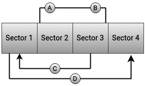

因此多数调度器会按扇区顺序维护请求队列，把新请求插到有序位置，尽量把相邻扇区请求连在一起做顺序访问。

### Merging（前后向合并）

合并是排序的补充。若两个请求目标扇区连续，就有机会合并：

- Back merge：新请求接在已有请求后面
- Front merge：新请求接到已有请求前面

Back merge 示例：

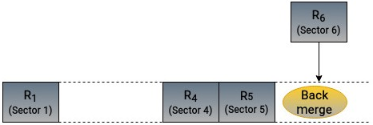

Front merge 示例：

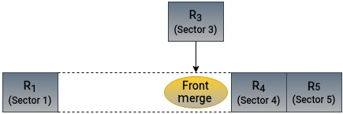

默认情况下，多数调度器都会尝试把新请求与队列中已有请求做前/后向合并，以减少随机跳转。

### Coalescing（并拢合并）

Coalescing 可以看成“前后向合并的组合形态”：新请求正好填补两个已有请求之间的空隙，把它们拼成一个更连续区间。

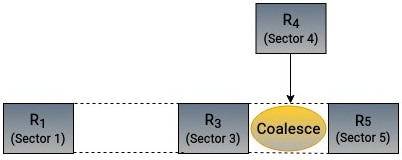

这对机械盘尤其有益：小而频繁的 I/O 被并拢后，磁头移动减少，整体吞吐更稳定。

### Plugging（插塞）

Plugging 看起来像“故意让请求先别发”，但目的是为了凑够批量，提高排序/合并命中率。  
如果队列里请求太少，几乎无从优化；先短暂积累再统一下发，通常能拿到更好的顺序性。

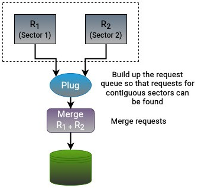

Plugging 主要发生在进程级别：  
进程提交一批 I/O 时，内核先暂存；进程提交完成后再统一推进到块层与驱动。若进程在插塞期间阻塞，调度器会处理当前已在队列中的请求。

## Linux I/O 调度器

I/O 调度器是块层与设备驱动之间的桥梁。它负责对请求做重排、合并、批量、分发，并在多个目标之间平衡：

- 降低寻道成本
- 保证请求公平性
- 提升磁盘吞吐
- 降低时延（尤其时间敏感任务）

这些目标相互牵制，调度器本质上是在做权衡。

选择调度器前，至少要明确：

- 主机类型：桌面、笔记本、虚拟机还是服务器
- 工作负载：数据库、交互应用、视频流、游戏等
- 应用是 CPU 受限还是 I/O 受限
- 后端介质：HDD、SSD、NVMe
- 存储是本地盘还是企业级 SAN

要注意：

- 磁盘调度不等于 CPU 调度
- 调度器调整应配合真实业务压测
- 不同环境不存在“唯一最优调度器”

Linux 把 I/O 调度器也称作 elevator。传统 SCAN 思路类似电梯：沿某一方向连续服务请求，尽量减少来回折返。

当前内核中的调度器可分为单队列和多队列两类：

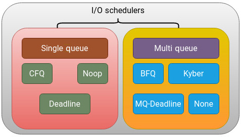

单队列调度器已在新内核里基本淘汰（5.0 之后不再是主流路径）。本章聚焦多队列四种：

- MQ-deadline
- BFQ
- Kyber
- None

## MQ-deadline：保障起始服务时间

deadline 系列的核心是“每个请求都有最迟起始服务时间”，防止饥饿。  
多队列版本叫 `mq-deadline`，常用于延迟敏感负载。

它主要维护两类队列：

- Sorted 队列：按扇区排序
- Deadline FIFO 队列：按截止时间排序（读写分离）

请求会同时进入这两类队列：

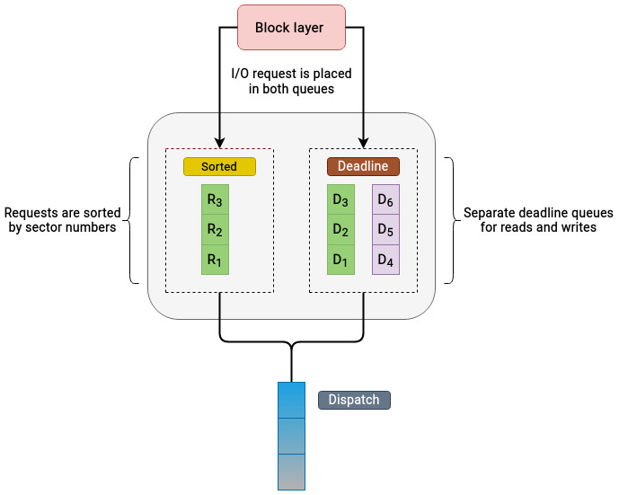

策略要点：

- 若读写队列都有请求，通常优先读（避免写把读饿死）
- 过期请求会被强制优先服务
- 默认按批次处理（例如 16 个）以提高顺序性
- 批次结束后检查写队列是否长期饥饿，再决定读写切换

请求处理过程示意：

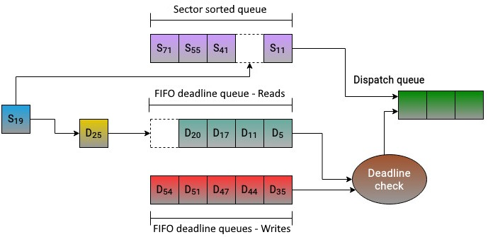

内核参数（`block/mq-deadline`）中可见典型配置：

- 读过期：`HZ/2`（约 500ms）
- 写过期：`5*HZ`（约 5s）
- `writes_starved=2`（读可连续优先）
- `fifo_batch=16`

结论：MQ-deadline 的优势是“全能且稳健”，在通用环境里通常是很可靠的默认选择之一。

## BFQ：按预算做比例公平

BFQ（Budget Fair Queuing）是较新的调度器，设计复杂度高，但交互体验和延迟控制表现好，尤其在慢设备与桌面场景常见。  
它源于 CFQ 思路，内部使用 B-WF2Q+ 等机制做公平分配。

核心思路：为每个进程分配 I/O 预算（budget），预算单位不是时间片，而是“允许传输的扇区数”。

队列模型：

- 每进程队列：主要放同步 I/O
- 每设备共享队列：主要放异步 I/O

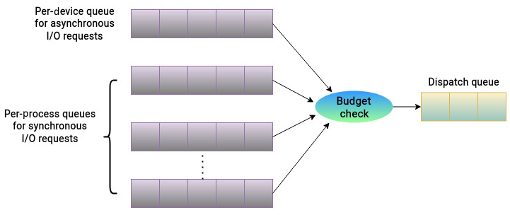

调度特点：

- 按队列预算和历史 I/O 行为分配磁盘份额
- 倾向优先服务预算小的队列，避免小随机请求长期等待
- 对 I/O 密集型进程给更大预算，促进顺序访问吞吐
- 支持队列合并：若两个进程访问区域相邻，可合并其队列提高顺序性
- 对异步请求可施加更高“预算扣减因子”，常见实现里会强化读优先

典型停止服务条件包括：

- 预算耗尽
- 队列请求处理完
- 等待新请求超时
- 单队列连续服务时间过长

结论：BFQ 功能丰富但开销更大，适合重视响应性、交互体验、时延平稳性的场景。

## Kyber：偏重高性能设备吞吐与低时延

Kyber 和 BFQ 都在 4.12 左右进入主线，但 Kyber 面向目标更明确：高性能 SSD/NVMe。

Kyber 设计相对简洁，不做过重的复杂重排，而是按请求类型分域管理：

- READ
- WRITE
- DISCARD
- OTHER

并对各类请求在分发队列中的并发深度设置上限（depth）。  
它的关键策略是：限制 dispatch queue 长度，降低请求排队等待时间。

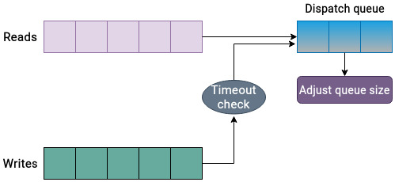

Kyber 会依据请求完成反馈动态调整队列深度，并可通过可调参数设置读/同步写目标延迟。  
若写请求长时间未被服务并突破目标延迟，它会提升写请求处理优先级。

结论：Kyber 非常适合高吞吐现代介质，在低延迟与高并发之间做简洁有效的平衡。

## None：最小调度开销

有些环境下，主机层“不做太多调度”反而更好。例如：

- 企业存储阵列或 RAID 控制器自身已有更全面调度逻辑
- 主机看不见底层真实布局，强行重排意义有限甚至冲突
- 现代高性能设备对传统机械盘优化技巧收益不大

这时可用 `none`（多队列 no-op）调度器。它基本不做复杂优化：

- 请求按 FIFO 进队
- 主要做基础合并
- 几乎无可调参数
- CPU 开销最低

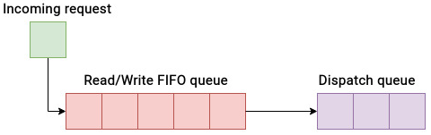

None 的前提假设是“下层控制器更懂怎么调度”。在很多企业 SAN 场景里，这个假设成立。

## 调度器选择难题

调度器应基于真实压测选择，不建议只凭经验拍板。  
可在线查看和切换：

```bash
# 查看当前调度器
cat /sys/block/sda/queue/scheduler
# 例如输出: [mq-deadline] none bfq kyber

# 临时切换
echo bfq > /sys/block/sda/queue/scheduler
```

上述切换通常重启后失效。若要持久化，可在 `/etc/default/grub` 增加内核参数（如 `elevator=bfq`），更新 GRUB 后重启。

经验上，切换调度器通常不是“翻倍提速”，常见改善在 `10%~20%` 区间，具体依赖场景。

可参考的基线建议：

| 场景 | 建议调度器 |
|---|---|
| 桌面 GUI、交互应用、软实时音视频 | BFQ（响应性和低延迟较好） |
| 传统机械盘 | BFQ 或 MQ-deadline |
| 本地高性能 SSD/NVMe | None（Kyber 也常是好选择） |
| 企业存储阵列 | None |
| 虚拟化环境 | MQ-deadline；若虚拟化层已自调度，可考虑 None |

这些不是硬规则。最终仍需结合应用类型、负载特征、主机形态、后端介质来做测试决策。

## 总结

本章介绍了块层 I/O 调度这一关键能力。  
请求从 VFS 各层下沉到块层后，调度器决定它们如何在底层设备上排队、合并、分发与服务。

我们先讲了四种常见优化手段：排序、合并、并拢合并、插塞；  
再分析了多队列时代四类主流调度器：MQ-deadline、BFQ、Kyber、None 的目标与取舍。

没有“放之四海而皆准”的单一最佳调度器。  
做选择时必须把工作负载、应用性质、宿主环境、存储介质和下层控制器能力一起纳入评估，并以真实基准测试结果为准。

本章至此也完成了本书第二部分（块层）的收束。下一章将进入物理存储介质层，讨论不同介质及其差异。
