# 对实际文件系统的探索

> 不是所有的根都被埋在地下，有些也在树梢上  jinvirle

内核的io栈被拆解成 虚拟文件系统，块层，物理层三个主要章节。 linux支持的不同风格的文件系统可以看作是vfs的末端。前两个章节让我们对vfs的角色定位，vfs的主要结构，以及它如何通过通用的文件模型帮助用户程序与不同的文件系统进行交互。这意味着我们终于可以在上下文中普遍的使用文件系统一词了。

在 第二章 中，我们定义并解释了 VFS 使用的一些重要数据结构，这些数据结构为不同的文件系统定义了一个通用框架。为了使某个特定的文件系统能够被内核支持，它应该在这个框架定义的边界内运行。但是，并非所有由 VFS 定义的方法都必须被文件系统使用。文件系统应遵循 VFS 中定义的结构并在此基础上进行扩展，以确保它们之间的通用性，但由于每个文件系统在组织数据方面的方式不同，这些结构中可能会有许多方法和字段对于某个特定文件系统并不适用。在这种情况下，文件系统根据其设计定义相关字段，省略不必要的信息。

如我们所见，VFS 位于用户空间程序与实际文件系统之间，并实现了一个通用文件模型，以便应用程序可以使用统一的访问方法来执行操作，而不管底层使用的是哪种文件系统。现在，我们将重点关注这个三明治的一个方面，即包含用户数据的文件系统。

本章将向你介绍 更通用和更受欢迎的linux文件系统，我们将详细讨论extfs文件系统的工作原理，因为它是最常用的。我们还将介绍一些网络文件系统，并探讨与文件系统相关的一些重要概念，如日志记录、用户空间中的文件系统和写时复制（CoW）机制。

我们将覆盖以下主要主题：

- 日志记录的概念

- CoW 机制

- 扩展文件系统家族

- 网络文件系统

- 用户空间中的文件系统

### 技术要求

这个章节完全聚焦于文件系统和相关的概念上，如果你有linux的管理使用经验，但没有深入的理解文件系统，那么本章将成为一个宝贵的练习。了解文件系统概念的前置知识将有助于你更好地理解本章所涉及的内容。本章中展示的命令和示例与发行版无关，可以在任何 Linux 操作系统上运行，如 Debian、Ubuntu、Red Hat、Fedora 等等。文中有一些关于内核源代码的参考。如果你想下载内核源代码，可以从www.kernel.org下载。本书中提到的代码片段来自内核 5.19.9。

## 文件系统的组成概念

正如之前所说，使用Linux的一个主要优点是其支持的文件系统种类繁多。内核对一部分文件系统提供了开箱即用的支持，如xfs，btrfs，ext2,3,4. 这些被称为本地文件系统，这些在设计时就考虑了linux的设计和哲学。与之相反的另外一种  像时nfs和fat，他们被称为非本地系统。这是因为虽然Linux内核能够识别这些文件系统，但支持它们通常需要额外的配置，因为它们不符合原生文件系统所采用的惯例。我们现在还是聚焦本地文件系统，并解释相关的概念。

尽管每个文件系统都声称自己比其他文件系统更快、更好、更可靠也更安全，但也要意识到，没有任何文件系统适合所有类型的应用。每个文件系统都有自己的优势和限制。从功能角度看，文件系统可以分为如下类别：

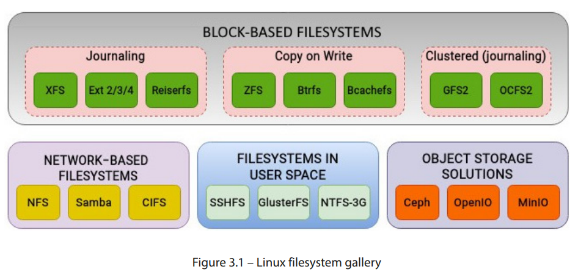


图 3.1 展示了一些支持的文件系统及其各自的类别。由于 Linux 支持大量的文件系统，覆盖所有文件系统将占用我们太多空间（这是一个文件系统的双关语！）。尽管实现细节有所不同，但文件系统通常会利用一些常见的技术来进行内部操作。一些核心概念，如日志记录，在文件系统中更为常见。类似地，一些文件系统使用了流行的 CoW 技术，因此它们不需要日志记录。

下面让我们解释文件系统的日志复制。

## 文件系统日志——日志记录的概念

文件系统使用一个复杂的结构来在物理磁盘上组织数据。在系统崩溃或突然故障的情况下，文件系统无法以优雅的方式完成其操作，这可能导致其组织结构受损。下次系统启动时，用户需要对文件系统运行某种一致性或完整性检查，以检测并修复这些损坏的结构。

在第二章节中，我们讨论过，Linux 遵循的一个基本原则是将元数据与实际数据分离开。文件的元数据被定义在叫做indoe的独立结构体中。我们还看到目录是如何被当作特殊文件来处理的，它包含文件名到其inode编号的映射。记住这一点，假设我们正在创建一个简单的文件，向其中添加一些文本。为了完成这个操作，内核需要执行以下操作：

- 给这个新文件创建并初始化一个新的inode，资格inode在文件系统里时唯一的。
- 更新这个文件目录的时间戳。
- 更新目录的inode。这是为了确保文件名到inode的映射得到更新。

即使是像文本文件创建这样简单的操作，内核也需要执行多个 I/O 操作以更新多个结构。假设在执行这些操作时，由于硬件或电力故障导致系统突然关闭。此时，创建新文件所需的所有操作都没有成功完成，这将导致文件系统结构不完整。如果文件的 inode 已初始化但未链接到包含该文件的目录，则该 inode 将被视为孤立的。一旦系统重新上线，文件系统将进行一致性检查，删除任何未链接到任何目录的 inode。系统崩溃后，文件系统本身可能保持完整，但个别文件可能会受到影响。在最坏的情况下，文件系统本身也可能会永久损坏。

为了在发生断电和系统崩溃时提高文件系统的可靠性，文件系统中引入了日志记录功能。第一个支持这一功能的文件系统是IBM的JFS（也称为日志文件系统）。在过去的几年中，日志记录已成为文件系统设计中的一个关键组成部分。

文件系统日志功能的概念起源于数据库系统的设计。在大多数数据库中，日志记录保证了数据的一致性和完整性，以防事务因外部事件（如硬件故障）而失败。数据库日志会通过记录操作来跟踪未提交的更改。当系统重新上线时，数据库将使用日志进行恢复。文件系统的日志功能也遵循相同的方式。

任何需要在文件系统上执行的更改，首先会顺序地写入日志。这些更改或修改被称为事务。一旦事务被写入日志，它会被写入磁盘上的相应位置。如果发生系统崩溃，文件系统会回放日志，查看是否有任何事务未完成。当事务已写入磁盘上的位置后，它就会从日志中删除。

根据日志记录的方式，首先会将元数据或实际数据（或两者）写入日志。一旦数据被写入文件系统，事务就会从日志中删除：

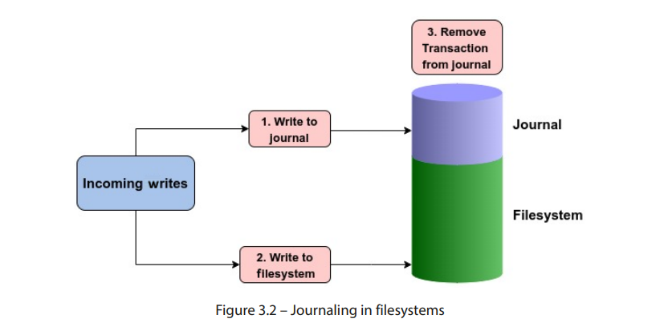

需要注意的是，默认情况下，文件系统日志也存储在同一文件系统中，尽管它被存储在一个隔离的区域。有些文件系统还允许将日志存储在独立的磁盘上。日志的大小通常只有几兆字节。

## 一个令人关注的问题——日志是否会对性能产生负面影响？

日志记录的意义在于提高文件系统的可靠性，并在系统崩溃和硬件故障的情况下保护其结构。在启用日志记录的文件系统中，数据首先写入日志，然后再写入其指定的磁盘位置。显而易见，我们在到达目的地时增加了额外的步骤，因为我们需要将相同的数据写两次。这肯定会适得其反，破坏文件系统的性能吧？

这是一个看似答案显而易见，但实际上并非如此的问题。使用日志记录并不一定会导致文件系统性能下降。事实上，在大多数情况下，情况恰恰相反。某些工作负载下，两者之间的差异可能微不足道，但在大多数场景中，尤其是在元数据密集型的工作负载下，文件系统日志记录实际上可以提高性能。性能提升的程度可能有所不同。

考虑一个没有日志记录的文件系统。每次修改文件时，采取的行动是直接在磁盘上执行相关的修改。对于元数据密集型操作，这可能会对性能产生负面影响。例如，文件内容的修改还需要相应地更新文件的时间戳。这意味着每次处理和修改文件时，文件系统不仅需要更新实际的文件数据，还需要更新元数据。启用日志记录后，对物理磁盘的查找次数较少，因为数据仅在事务已提交到日志或日志已满时才会写入磁盘。另一个好处是日志中使用了顺序写入。在使用日志时，随机写操作会转化为顺序写操作。

在大多数情况下，性能的提升是通过取消元数据操作来实现的。当需要快速更新元数据时，比如递归地对目录及其内容进行操作，使用日志记录可以通过减少频繁的磁盘访问并在原子操作中执行多个更新来提高性能。

当然，文件系统如何实现日志记录在其中也起着重要作用。不同的文件系统在日志记录方面提供了不同的处理方式。例如，一些文件系统只记录文件的元数据，而另一些则在日志中同时记录元数据和实际数据。一些文件系统还提供灵活的处理方式，允许最终用户自行决定日志记录模式。

总结来说，日志记录是现代文件系统的重要组成部分，因为它确保即使在系统崩溃的情况下，文件系统仍然保持结构的完整性。

--  文件系统的cow的神奇之处：

CoW 是一种在 Linux 内核中使用的资源管理机制。这个概念通常与fork系统调用相关。fork从被调用进程复制一个新的进程。当一个新的进程被创建时，内存页被父进程和子进程共享。那么页被共享了 他们就不能被修改。当父进程或者子进程修改内存页面时，内核会复制一份并标记为可写。

在 Linux 中，长期存在的大多数文件系统在核心设计原则上采用了非常传统的方法。在过去的几年里，扩展文件系统的两个主要变化是使用日志记录和扩展（extents）。尽管已经采取了一些措施来扩展文件系统以适应现代应用，但一些关键领域如错误检测、快照和去重等却被忽略了。这些功能是当今企业存储环境中的需求。

使用 CoW（写时复制）方法的文件系统与其他文件系统有一个显著的不同。当在 Ext4 或 XFS 文件系统上覆盖数据时，新数据会写到现有数据上方。这意味着原始数据会被销毁。而使用 CoW 方法的文件系统则将旧数据复制到磁盘的其他位置，新的数据会写入这个新位置。因此，才有了写时复制这一术语。由于旧数据或其快照仍然存在，文件系统上的空间利用率会比用户预期的要高得多。这常常让新手用户感到困惑，可能需要一段时间才能适应。一些 Linux 用户对此有一种相当幽默的看法：写时复制吃掉了我的数据。如图 3.3所示，使用 CoW 方法的文件系统会将新数据写入新的块：

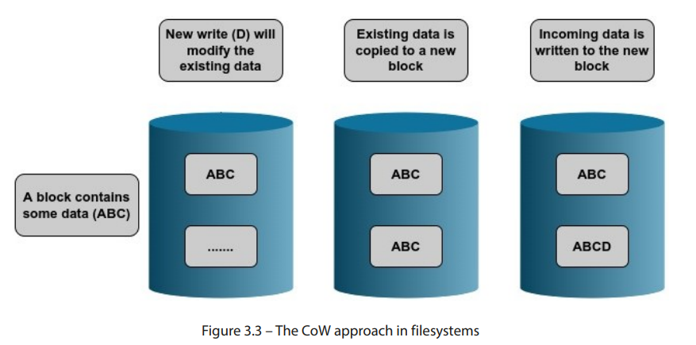


作为类比，我们可以将其与电影中的时间旅行概念进行粗略比较。当有人回到过去并对过去做出更改时，会创建一条平行时间线。这会产生与原始时间线不同的副本。CoW 文件系统的操作方式类似。当请求修改文件时，系统不会直接修改原始数据，而是创建数据的一个单独副本。原始数据保持不变，而修改后的版本则存储在另一个位置。

由于在此过程中保留了原始数据，这为我们开辟了一些有趣的方向。正因如此，在系统崩溃的情况下，文件系统恢复变得更加简化。数据的先前状态被保存在磁盘上的另一个位置。因此，如果发生故障，文件系统可以轻松恢复到先前的状态。这使得维护任何日志文件的需求变得多余。它还允许在文件系统级别实现快照。只有被修改的数据块才会被复制到新位置。当需要通过特定的快照恢复文件系统时，数据可以轻松地重建。

表 3.1 突出了日志文件系统和基于 CoW 文件系统之间的一些主要区别。请注意，这些功能的实现和可用性可能会根据文件系统类型的不同而有所变化：

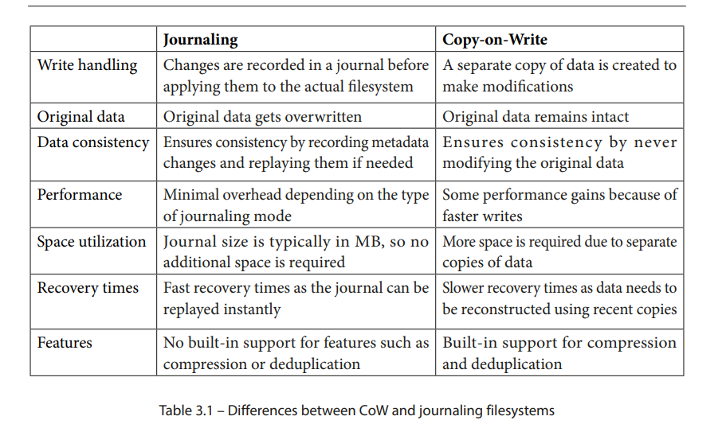

使用基于 CoW（写时复制）方法来组织数据的文件系统包括Zettabyte 文件系统（ZFS）、B 树文件系统（Btrfs）和 Bcachefs。ZFS 最初在 Solaris 上使用，并因其强大的功能迅速获得了广泛的应用。尽管由于许可问题未能纳入内核，但它已经通过ZFS on Linux项目移植到了 Linux 上。Bcachefs 文件系统是从内核的块缓存代码开发而来的，并且正迅速获得流行。它可能会成为未来内核发布的一部分。Btrfs，也被亲切地称为 ButterFS，直接受 ZFS 启发。不幸的是，由于早期版本中的一些 bug，它在 Linux 社区的采用进程放缓。然而，它一直在积极开发，并且已经成为 Linux 内核的一部分超过十年。

尽管存在一些问题，Btrfs 仍然是内核中最先进的文件系统，因其丰富的功能集。如前所述，Btrfs 受到了 ZFS 的深刻影响，并力图提供几乎相同的功能。像 ZFS 一样，Btrfs 不仅仅是一个简单的磁盘文件系统，它还提供了逻辑卷管理器和软件独立磁盘冗余阵列（RAID）的功能。它的一些功能包括快照、校验和、加密、去重和压缩，这些功能通常在常规块文件系统中无法使用。所有这些特点极大简化了存储管理。

总结来说，像 Btrfs 和 ZFS 这样的文件系统的 CoW 方法确保现有数据永远不会被覆盖。因此，即使在系统突然崩溃的情况下，现有数据也不会处于不一致的状态。

## Ext 文件系统

extented 文件系统也叫作Ext，自Linux内核诞生以来，它就是Linux内核的可靠助手，几乎和Linux内核一样古老。他在内核0.96版本被引入。多年来，扩展文件系统经历了一些重大变化，导致出现了多个版本的文件系统。这些版本简要说明如下：

1. ext.1: 第一个运行文件系统的linux是minix，他支持最大大小是64M，ext文件系统的设计是为了克服minix的不足，因此也通常被认为是minix的文件系统。ext支持最大大小是2GB，他也是第一个使用vfs的文件系统。ext.1中每个文件只有一个时间戳，而今天的文件系统中，每个文件都有三个时间戳。
2. ext.2: 在est.1 发布后一年的时间，ext.2被发布，Ext2文件系统解决了其前代文件系统的一些限制，例如分区大小、碎片化、文件名长度、时间戳以及最大文件大小。它还引入了若干新功能，包括文件系统块的概念。Ext2的设计灵感来源于BSD的Berkeley快速文件系统。Ext2文件系统支持更大的文件系统大小，最高可达几个太字节。
3. ext.3：Ext2 文件系统得到了广泛应用，但在系统崩溃时仍然存在碎片化和文件系统损坏的巨大问题。第三扩展文件系统 Ext3 在设计时考虑到了这一点。该版本引入的最重要特性是日志功能。通过日志功能，Ext3 文件系统可以跟踪未提交的更改。这在系统因硬件或电力故障崩溃时，减少了数据丢失的风险。

4. ext.4：Ext4 是扩展文件系统家族中目前最新的版本。Ext4 文件系统在性能、碎片化和可扩展性方面相较于 Ext2 和 Ext3 提供了若干改进，同时保持了与 Ext2 和 Ext3 的向后兼容性。在 Linux 发行版中，Ext4 可能是最常部署的文件系统。

我们将主要关注最新版本的扩展文件系统 Ext4 的设计和结构。


## 块——文件系统的通用语言

在最低层上，硬盘是以扇区为单位进行寻址的。扇区是磁盘驱动器的物理属性，通常大小为 512 字节。使用 4 KB 扇区大小的驱动器也很多。扇区大小是我们无法更改的，因为它是由驱动器制造商决定的。由于扇区是驱动器上最小的可寻址单位，任何对物理驱动器执行的操作，都会大于或等于扇区大小。

文件系统是建立在物理驱动器之上的，并且不以扇区为单位来访问驱动器。所有文件系统（ext文件系统系列也不例外）都是以块为单位来访问物理驱动器。块是物理扇区的集合，是文件系统的基本单位。Ext4 文件系统在进行所有操作时，都是以块为单位。在 x86 系统上，文件系统的块大小默认设置为 4 KB。虽然可以设置为更小或更大的值，但块大小应始终满足以下两个约束条件：

- 块大小应始终是磁盘扇区大小的二次幂倍数。
- 块大小应始终小于或等于内存页大小。

文件系统的最大块大小是操作系统架构的页面大小。在大多数基于 x86 的系统上，内核的默认页面大小为 4 KB。因此，文件系统块大小不能超过 4 KB。VFS 缓存的页面大小也为 4 KB。块大小限制不仅限于ext文件系统。页面大小在内核编译时定义，对于 x86_64 系统为 4 KB。如下所示，对于 Ext4 的mkfs程序，如果指定的块大小大于页面大小，将会发出警告。即使使用大于页面大小的块大小创建文件系统，也无法挂载：

```
[root@linuxbox ~]# getconf PAGE_SIZE
4096
[root@linuxbox ~]# mkfs.ext4 /dev/sdb -b 8192
Warning: blocksize 8192 not usable on most systems.
mke2fs 1.44.6 (5-Mar-2019)
mkfs.ext4: 8192-byte blocks too big for system (max 4096)
Proceed anyway? (y,N) y
Warning: 8192-byte blocks too big for system (max 4096), forced to continue
[....]
[root@linuxbox ~]# mount /dev/sdb /mnt
mount: /mnt: wrong fs type, bad option, bad superblock on /dev/sdb, missing codepage or helper program, or other error.
[root@linuxbox ~]#
[root@linuxbox ~]# dmesg |grep bad
[ 5436.033828] EXT4-fs (sdb): bad block size 8192
[ 5512.534352] EXT4-fs (sdb): bad block size 8192
[root@linuxbox ~]#

```

一旦文件系统创建完成，块大小就无法更改。默认情况下，Ext4 文件系统将可用存储空间分割为 4 KB 的逻辑块。选择块大小对文件系统的空间利用效率和性能有重大影响。块大小决定了文件的最小磁盘大小，即使实际大小小于块大小。假设我们的文件系统使用 4 KB 的块大小，我们在其上保存一个包含 10 字节的简单文本文件。这个 10 字节的文件，在物理磁盘上存储时将占用 4 KB 的空间。一个块只能容纳一个文件。这意味着对于一个 10 字节的文件，块中剩余的空间（4 KB - 10 字节）将被浪费。如下所示，一个包含字符串"hello"的简单文本文件将占用整个文件系统块：

```
robocop@linuxbox:~$ echo "hello" > file.txt
robocop@linuxbox:~$ stat file.txt
  File: file.txt
  Size: 6               Blocks: 8          IO Block: 4096   regular file
Device: 803h/2051d      Inode: 2622288     Links: 1
Access: (0664/-rw-rw-r--)  Uid: ( 1000/   robocop)   Gid: ( 1000/   robocop)
Access: 2022-11-10 12:55:55.406596713 +0500
Modify: 2022-11-10 13:01:12.962761327 +0500
Change: 2022-11-10 13:01:12.962761327 +0500
 Birth: -
robocop@linuxbox:~$
```

stat命令给出了一个块计数为8，但这有点误导，因为实际上这是扇区计数。这是因为stat系统调用假设每个块分配了 512 字节的磁盘空间。这里的块计数表示在磁盘上实际分配了4096字节（8 x 512）。文件大小只有6字节，但它占据了一个完整的块。如下所示，当我们在文件中添加另一行文本时，文件大小从6增加到19字节，但使用的扇区和块的数量保持不变：

```
robocop@linuxbox:~$ echo "another line" >> file.txt
robocop@linuxbox:~$ stat file.txt
  File: file.txt
  Size: 19              Blocks: 8          IO Block: 4096   regular file
Device: 803h/2051d      Inode: 2622288     Links: 1
Access: (0664/-rw-rw-r--)  Uid: ( 1000/   robocop)   Gid: ( 1000/   robocop)
Access: 2022-11-10 12:55:55.406596713 +0500
Modify: 2022-11-10 13:01:59.772249416 +0500
Change: 2022-11-10 13:01:59.772249416 +0500
 Birth: -
robocop@linuxbox:~$
```


## 是否有更有效的方式组织数据

由于一个小文本文件占据一个完整的块，可以看出文件系统块大小的影响。在大块大小的文件系统上有很多小文件可能导致磁盘空间的浪费，并且文件系统很快可能用尽块。我们来看一个更清晰理解的可视化表示。

假设我们有四个不同大小的文件如下：

    文件 A -> 5 KB

    文件 B -> 1 KB

    文件 C -> 7 KB

    文件 D -> 2 KB

按照分配一个完整块（4 KB）给单个文件的方法，文件将存储在磁盘上如下：


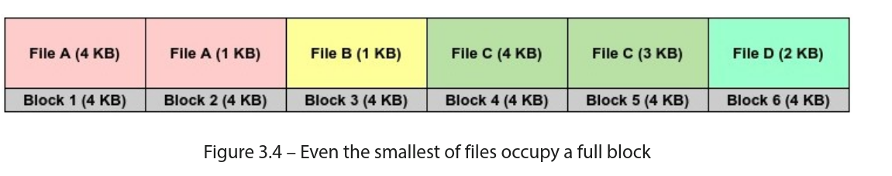

正如图 3.4所示，我们在第 2 和第 3 块中浪费了 3 KB 的空间，在第 5 和第 6 块中分别浪费了 1 KB 和 2 KB 的空间。显然，太多的小文件会浪费块空间！

让我们尝试一种替代方法，并尝试以更紧凑的格式存储文件，以避免浪费空间：


不难看出，第二种方法更紧凑且高效。现在，我们能够仅用四个块存储相同的四个文件，而不是第一个方法中的六个块。我们甚至能够节省 1 KB 的文件系统空间。显然，为单个文件分配一个完整的文件系统块似乎是一种低效的空间管理方法，但实际上，这是必要的权宜之计。
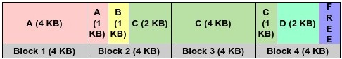
从第一眼看，第二种方法似乎好得多，但你看出设计缺陷了吗？如果文件系统采用这种方法，可能会遇到重大的问题。如果文件系统设计为在单一块中容纳多个文件，它们需要设计一种机制来跟踪单个块内每个文件的边界。这会大大增加设计的复杂性。此外，这还会导致严重的碎片化，从而降低文件系统的性能。如果文件的大小增加，新增的数据将不得不调整到一个单独的块中。文件将存储在随机块中，没有顺序访问。所有这些都会导致文件系统性能差，并使这种紧凑方法的任何优势都变得毫无意义。因此，每个文件都占据一个完整的块，即使它的大小小于文件系统块的大小。


## Ext4 文件系统的布局

Ext4中的单个块被排列成另一个称为块组的单元。块组是连续块的集合。关于块组的组织，有两种情况。对于第一个块组，不使用前1,024字节。这些是为安装引导扇区保留的。对于第一个块组，布局如下：

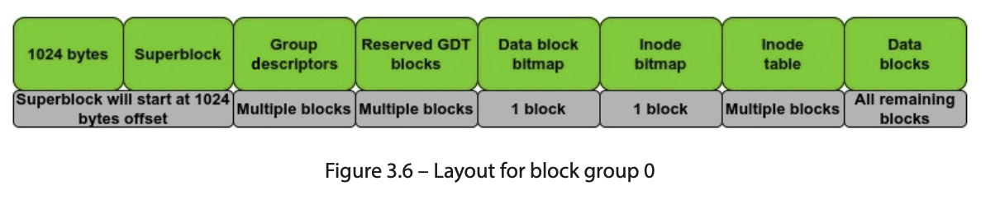

如果创建的文件系统块大小为1 KB，则超级块将保留在下一个块中。对于所有其他块组，布局如下：

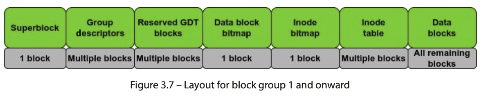

让我们来讨论Ext4块组的组成部分。

### super block

如第2章所述，超级块是VFS中的主要数据结构之一。文件系统必须实现包含文件系统元数据的超级块结构。Ext4超级块在fs/ext4/ext4.h中定义，如下图所示，它包含数十个定义文件系统不同属性的字段：

```
struct ext4_super_block {
__le32 s_inodes_count; /* Inodes count */
__le32 s_blocks_count_lo; /* Blocks count */
__le32 s_r_blocks_count_lo; /* Reserved blocks count */
__le32 s_free_blocks_count_lo; /* Free blocks count */
__le32 s_free_inodes_count; /* Free inodes count */
__le32 s_first_data_block; /* First Data Block */
__le32 s_log_block_size; /* Block size */
__le32 s_log_cluster_size; /* Allocation cluster size */
/*20*/ __le32 s_blocks_per_group; /* # Blocks per group */
__le32 s_clusters_per_group; /* # Clusters per group */
__le32 s_inodes_per_group; /* # Inodes per group */
__le32 s_mtime; /* Mount time */
/*30*/ __le32 s_wtime; /* Write time */
__le16 s_mnt_count; /* Mount count */
[……]
```

__Le32数据类型表明表示是小端顺序。从其在内核源中的定义中可以看出，Ext4超级块定义了许多属性来表征文件系统。这包含一些信息，例如文件系统中的块和块组总数、已使用和未使用的块总数、块大小、已使用和未使用的inode总数、文件系统状态等。超级块中包含的信息至关重要，因为它是安装文件系统时首先读取的信息。鉴于其关键性质，超级块的多个副本被保存在不同的位置。

超级块定义中的大多数字段都很容易理解。这里解释了一些有趣的领域：

- 块大小计算：Ext4文件系统的块大小使用此32位值计算。块大小计算如下：Ext4块大小=2 ^（10 + s_log_block_size）当s_log_block_size为零时，Ext4文件系统的最小块大小可以是1 KB。Ext4文件系统支持最大块大小为64 KB。

- 块集群：尽管在过去几年中磁盘驱动器的容量呈指数级增长，但Ext4文件系统的工作区块大小为几千字节。驱动器越大，区块的数量和开销就越大。作为变通办法，Ext4开发人员在Ext4中添加了块集群的功能。文件系统可以使用块组的概念在更大的组中分配块，而不是分配单个4 KB块。Ext4文件系统维护这些较大的块和4 KB块之间的映射。这个功能被称为bigalloc。块集群大小可以在文件系统创建时指定，并存储在s_log_cluster_size中。

- 文件系统状态和检查：文件系统一致性检查可以在三种情况下触发。`s_mnt_count` 字段表示自上次检查以来文件系统挂载次数，`s_max_mnt_count` 为强制检查的挂载上限。文件系统状态保存在 `s_state` 中，常见状态包括：干净卸载、检测到错误、正在恢复孤儿 inode。若状态非干净，会自动触发检查。上次检查时间在 `s_lastcheck` 中；如果距离上次检查已超过 `s_checkinterval` 设定的间隔，也会强制执行一致性检查。

- 魔术签名：不同的文件系统使用在一定偏移处出现的魔术数字的概念。不同的工具使用这个数字来识别特定文件系统类型。超级块中的s_magic字段包含这个魔术数字。对于Ext4，其值为0xEF53。S_rev_level和s_minor_rev_level字段用于区分文件系统版本。

- 块保留：这些是保留块的默认用户和组 ID。这些默认值为0（根用户）。Ext4文件系统为超级用户或根用户保留5%的文件系统块。这样做是为了让根用户进程继续运行，即使非根进程无法写入文件系统。第一个inode编号：这是可用于常规文件和目录的第一个inode编号。这个值通常为11，它属于Ext4文件系统上的丢失+发现目录。

- 文件系统UUID：这是一个128位值，用作Ext4文件系统的唯一卷标识符。在经常添加和删除驱动器的系统上，设备名称（如sda和sdb）经常会发生变化，导致混乱和安装点不正确。UUID是文件系统的唯一标识符，可以在/etc/fstab中用于挂载文件系统。

- 兼容功能：这两个值都是32位。S_feature_compat字段包含相容功能的32位位掩码。文件系统可以免费支持此字段中定义的功能。另一方面，如果内核不理解s_feature_incompat中定义的任何特征，文件系统挂载操作将无法成功。

### 数据块位图和 inode 位图

Ext4 文件系统只用很少的空间来组织内部结构，绝大部分空间还是用于存放用户数据。用户数据放在数据块中，而每个文件的元数据放在 inode 结构中。inode 也在磁盘上占用一块保留区域。由于 inode 在同一个文件系统内必须唯一，所以文件系统必须有一种机制来跟踪哪些 inode 已分配、哪些 inode 还空闲；数据块也是同样的问题。

Ext4 使用位图（bitmap）来完成分配管理。位图本质上是一个 bit 序列。Ext4 分别使用 inode 位图和数据块位图来跟踪使用情况：

- 数据块位图：跟踪某个块组里数据块的占用状态
- inode 位图：跟踪 inode 表里每个 inode 条目的占用状态

位值 `0` 表示可用，位值 `1` 表示已占用。

inode 位图和数据块位图都各自占用 1 个块。因为 1 字节有 8 位，若块大小为默认的 4 KB，那么一个块位图最多可表示 `8 x 4 KB = 32,768` 个块（每组）。这个值可以通过 `mkfs` 或 `tune2fs` 的输出进行验证。

### inode 表

除了 inode 位图外，每个块组还包含 inode 表（inode table），它是一串连续的块。Ext4 inode 的结构定义在 `fs/ext4/ext4.h`：

```c
struct ext4_inode {
        __le16  i_mode;         /* File mode */
        __le16  i_uid;          /* Low 16 bits of Owner Uid */
        __le32  i_size_lo;      /* Size in bytes */
        __le32  i_atime;        /* Access time */
        __le32  i_ctime;        /* Inode Change time */
        __le32  i_mtime;        /* Modification time */
        __le32  i_dtime;        /* Deletion Time */
        __le16  i_gid;          /* Low 16 bits of Group Id */
        __le16  i_links_count;  /* Links count */
        __le32  i_blocks_lo;    /* Blocks count */
        __le32  i_flags;        /* File flags */
        [...]
}
```

Ext4 inode 大小为 256 字节。几个重要字段如下：

- 所有权：`i_uid` 和 `i_gid` 分别表示用户 ID 和组 ID。
- 时间戳：`i_atime`、`i_ctime`、`i_mtime` 分别记录访问时间、inode 变更时间、数据修改时间；`i_dtime` 记录删除时间。这几个字段是 32 位有符号整数，表示自 Unix 纪元（1970-01-01 00:00:00 UTC）以来的秒数。需要亚秒精度时会用 `i_atime_extra`、`i_mtime_extra`、`i_ctime_extra`。
- 硬链接计数：`i_links_count` 是 16 位值，因此 Ext4 单文件硬链接上限约为 65K。
- 数据块指针：`i_block` 是长度为 `EXT4_N_BLOCKS` 的数组（值为 15）。前 12 个是直接指针；第 13、14、15 个是间接指针，分别提供一级、二级、三级间接寻址。

### 组描述符（group descriptors）

在文件系统布局中，组描述符位于超级块之后。每个块组都有一个组描述符，所以块组有多少个，组描述符就有多少个。它描述的是整个文件系统中每个块组的内容（不仅仅是本地块组）。`fs/ext4/ext4.h` 中定义如下：

```c
struct ext4_group_desc {
        __le32  bg_block_bitmap_lo;      /* Blocks bitmap block */
        __le32  bg_inode_bitmap_lo;      /* Inodes bitmap block */
        __le32  bg_inode_table_lo;       /* Inodes table block */
        __le16  bg_free_blocks_count_lo; /* Free blocks count */
        __le16  bg_free_inodes_count_lo; /* Free inodes count */
        __le16  bg_used_dirs_count_lo;   /* Directories count */
        __le16  bg_flags;                /* EXT4_BG_flags ... */
        [...]
}
```

重点字段可以这样理解：

- 位图位置：`bg_block_bitmap_*`、`bg_inode_bitmap_*`、`bg_inode_table_*` 记录块位图、inode 位图和 inode 表在磁盘上的位置（低位和高位分开保存）。
- 资源使用：`bg_free_blocks_count_*`、`bg_free_inodes_count_*`、`bg_used_dirs_count_*` 记录空闲块、空闲 inode、目录数量。

因为每个块组描述符都带有对全局块组的描述信息，所以从任意一个块组都能推断出下面这些信息：

- 文件系统空闲块和空闲 inode 数量
- inode 表位置
- 块位图和 inode 位图位置

### 预留 GDT 块

Ext4 的一个实用能力是在线扩容（on-the-fly expansion）：在不中断业务的情况下扩大文件系统容量。为此，Ext4 在创建文件系统时就预留了 GDT（group descriptor table）块。扩容时新增磁盘空间会带来新的块组，也就需要更多组描述符，这些预留 GDT 块正是用于这个目的。

### 日志模式（journaling modes）

和多数文件系统一样，Ext4 也通过日志机制在系统崩溃时减少数据损坏和结构不一致。默认日志大小通常只有几 MB。Ext4 的日志依赖内核通用日志层 JBD/JBD2（journaling block device）。你在高负载系统上看 I/O 进程时，可能见过 `jbd2` 线程，它就是负责维护 Ext4 日志的内核线程。

Ext4 支持三种日志模式：

- Ordered：只记录元数据日志，数据直接落盘。顺序严格为“元数据写日志 -> 数据写盘 -> 元数据写盘”。崩溃时结构可保，但正在写的数据可能丢失。
- Writeback：也只记录元数据日志，但数据和元数据写入顺序不强制，风险比 ordered 略高，但性能更好。
- Journal：数据和元数据都先写日志再落盘，一致性最好，但写路径变成两次写，性能可能受影响。

默认模式是 `ordered`。如果你想切换模式，需要先卸载文件系统，然后在 `/etc/fstab` 对应挂载项加参数。例如切到 writeback：

```bash
/dev/sdc on /mnt type ext4 (rw,relatime,data=writeback)
```

你也可以通过 `debugfs` 的 `logdump` 查看日志信息：

```bash
[root@linuxbox ~]# debugfs -R 'logdump -S' /dev/sdc
debugfs 1.44.6 (5-Mar-2019)
Journal features:           journal_64bit journal_checksum_v3
Journal size:               32M
Journal length:             8192
Journal sequence:           0x00000005
Journal start:              1
Journal checksum type:      crc32c
Journal checksum:           0xb78622f2
...
```

### 文件区段（extents）

前面提到过 inode 可用间接指针来寻址大文件，但当文件非常大时，指针数量和映射复杂度都会显著上升，元数据开销也会变大，进而拖慢部分操作。

Ext4 通过 extents 改善这个问题。extent 可以理解为“起始块地址 + 连续块长度”。如果一段数据块是连续的，只需记录这段区间，而不是为每个块单独维护指针。比如使用 4 MB extent 存储 100 MB 文件，可分配 25 个连续区段，仅需跟踪每段边界。若使用传统指针法（按 4 KB 块），100 MB 大约需要映射 25,600 个块。

### 块分配策略

碎片化是文件系统性能的隐形杀手。Ext4 在块分配上做了多种优化，核心目标是把“相关数据尽量放在同一个块组”：

- 新建文件时，尽量把 inode 分配到父目录所在块组
- 文件数据尽量分配到其 inode 所在块组

文件后续扩展时，Ext4 会从该文件最近一次分配块的位置开始搜索空闲块。

Ext3 的分配器一次只分配一个 4 KB 块。假设文件是 100 MB，就需要调用分配器 25,600 次。并且扩容时拿到的新块可能离散，带来更多随机寻道和碎片。Ext4 的多块分配器（multi-block allocator）则可以一次分配多个块，减少分配开销并提升性能；文件真正使用这些块时，会按单个多块 extent 写入，没用完的额外块会释放。

Ext4 还使用延迟分配（delayed allocation）：写请求发生时不立即分配磁盘块，而是先利用页缓存，等真正刷盘时再分配，从而更容易拿到连续块，减少碎片。

### 查看 mkfs 的结果

下面用一个 1 GB 磁盘执行 `mkfs.ext4 -v /dev/sdb` 的输出做总结：

```bash
[root@linuxbox ~]# mkfs.ext4 -v /dev/sdb
mke2fs 1.44.6 (5-Mar-2019)
fs_types for mke2fs.conf resolution: 'ext4'
Discarding device blocks: done
Filesystem label=
OS type: Linux
Block size=4096 (log=2)
Fragment size=4096 (log=2)
Stride=0 blocks, Stripe width=0 blocks
65536 inodes, 262144 blocks
13107 blocks (5.00%) reserved for the super user
First data block=0
Maximum filesystem blocks=268435456
8 block groups
32768 blocks per group, 32768 fragments per group
8192 inodes per group
Filesystem UUID: ebcfa024-f87b-4c52-b3e1-25f1d4d31fec
Superblock backups stored on blocks:
        32768, 98304, 163840, 229376
Allocating group tables: done
Writing inode tables: done
Creating journal (8192 blocks): done
Writing superblocks and filesystem accounting information: done
```

关键信息解读：

- `Discarding device blocks`（TRIM）对 SSD 特别有价值，通知设备可擦除未使用块。
- 文件系统有 `262,144` 个 4 KB 块，共 `65,536` 个 inode。
- 默认有 `5%` 空间保留给超级用户。
- `8` 个块组，每组 `32,768` 块，每组 `8,192` inode，总 inode 数与输出一致。
- 主超级块损坏时，可以用备份超级块恢复挂载。
- 日志区 `8,192` 个块，按 4 KB 计算约 `32 MB`。

总体上，Ext 系列是 Linux 平台最老牌的文件系统家族之一。Ext4 在可靠性、扩展性、性能上都经历了持续演进。像日志、extent、延迟分配等能力在 XFS 等文件系统中也有对应设计（实现细节不同）。作为 Linux 原生文件系统，Ext4 广泛实现并利用了 VFS 定义的通用结构，因此至今依然是发行版里最常见的文件系统之一。

## 网络文件系统

随着网络和协议的发展，远程文件共享成为可能，这推动了分布式计算和 C/S 架构的发展。核心思想是：把数据放在一个或多个中心服务器上，由多个客户端通过不同协议访问。常见协议包括 FTP、SFTP 等。

与本地文件系统相比，分布式文件系统要多出一层网络通信逻辑。本地场景下，请求进程和存储资源在同一台机器上；而在分布式场景里，客户端程序收到诸如 `read()` 的调用后，需要把请求消息发给远端服务器，由服务器完成资源访问。

最经典的实现之一是 NFS（Network Filesystem）。NFS 由 Sun Microsystems 于 1984 年提出，是典型的分布式文件系统协议，允许访问远程存储文件。当前常用的是 NFSv4。由于通信跨网络，客户端请求需要穿过 OSI 模型的各层。

### NFS 架构

从架构上看，NFS 有三个关键组成部分：

- RPC（Remote Procedure Call）：NFS 客户端和服务端通过 RPC 通信。RPC 是 IPC 的扩展，调用过程可以位于远程地址空间（不必在本地进程地址空间）。
- XDR（External Data Representation）：NFS 在 OSI 表示层用 XDR 编码二进制数据，解决异构系统（例如大小端不同）间的数据表示差异。
- NFS Procedures：应用层定义了文件操作、目录操作、文件系统操作等具体过程。

NFS 的 I/O 请求路径如下图所示：

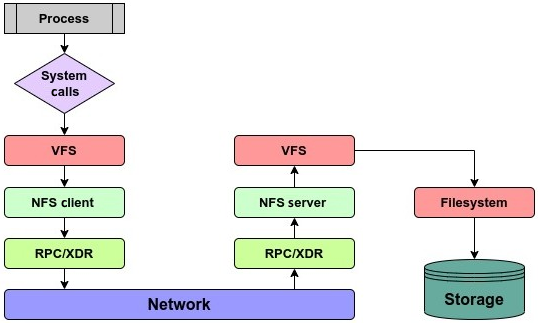

NFSv2 主要跑在 UDP 上，因此 v2/v3 偏无状态；v4 默认改为 TCP，更可靠，且是有状态协议，客户端和服务端会维护打开文件与锁信息。v4 还引入 compound request，可把多个操作合并为一次 RPC 请求。

和本地文件系统一样，NFS 也需要挂载后才能使用，但与本地不同的是：NFS 不需要在客户端新建文件系统，因为远端已经存在。挂载命令里指定的是服务端导出的目录（export）。NFS 服务端维护可导出的文件系统列表以及允许访问这些导出的主机列表。

NFS 通过 file handle 唯一标识文件，通常包含 inode 编号、文件系统标识和 generation number（代数）。代数用于处理 inode 复用场景，避免“旧文件 A 删除后，新文件 B 复用了同 inode 编号导致误识别”的问题。

### 与块文件系统的比较

网络文件系统也叫文件级存储（file-level storage）。因此 NFS 上的 I/O 属于文件级 I/O，请求中通常不直接指定磁盘块地址；文件在磁盘上的真实位置管理由 NFS 服务端负责。服务端收到请求后，会转换为底层块级请求再执行。

这带来了额外开销，也是 NFS 性能通常不如本地块文件系统的主要原因之一。本地块存储场景下，应用对块访问和修改策略有更高控制力；而 NFS 中，文件系统结构的管理由服务端统一承担。

NFS 与块文件系统在数据路径上的差异如下：

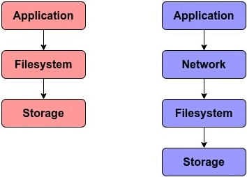

总结来说，NFS 仍然是企业里最常见的远程共享协议之一。尽管性能通常落后于本地块存储，但在备份、归档、共享数据等场景依然非常实用。

## FUSE：一种在用户态实现文件系统的方法

我们前面讲过，系统资源和内核代码（包含文件系统代码）位于内核空间，普通用户态程序不能直接改动内核代码。这种隔离保障了系统安全，但也带来开发和调试成本：一旦文件系统代码出 bug，排查难度很高，很多操作还必须以 root 执行。

FUSE（Filesystem in Userspace）就是为缓解这些问题设计的。它允许你在用户态实现文件系统逻辑，而不需要直接修改内核文件系统代码。这样一来，文件系统的数据和元数据都可以由用户态进程管理，非特权用户也能挂载 FUSE 文件系统，灵活性很高。

另外，FUSE 文件系统可以是可堆叠（stackable）的，也就是部署在 Ext4/XFS 之类现有文件系统之上。GlusterFS 就是典型例子之一：它运行在用户态，并可叠加在现有块文件系统之上。

FUSE 的实现由两部分组成：

- 内核模块 `fuse.ko`：向 VFS 注册 FUSE 文件系统
- 用户态守护进程（基于 `libfuse`）：通过字符设备 `/dev/fuse` 与内核模块通信

数据流如下图：

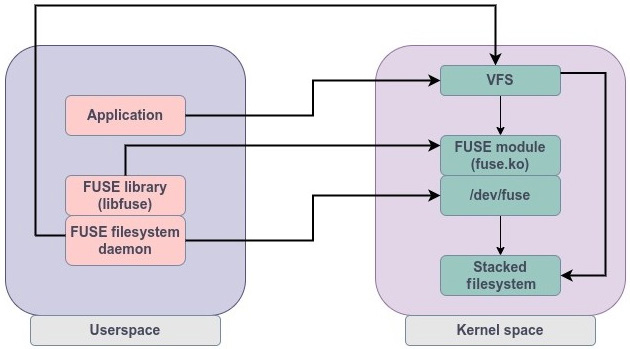

当用户进程访问 FUSE 文件系统时，系统调用先到 VFS。VFS 识别为 FUSE 后，会转给 `fuse.ko`。FUSE 驱动构造请求并放入 `/dev/fuse` 队列，再由用户态守护进程读取和处理。如果该 FUSE 文件系统是堆叠在别的文件系统之上，处理后的请求还会再次回到内核路径并继续下发到底层文件系统。

FUSE 在健壮性上通常不如传统内核态文件系统，但它的部署和开发效率非常高。更重要的是，文件系统代码在用户态，即使有 bug 也不会直接拖垮内核。

## 总结

前两章重点解释了 VFS 的工作机制，而本章把视角下沉到了 VFS 之下的实际文件系统。Linux 内核可支持的文件系统非常多，不可能逐一覆盖，所以我们重点讲了 Linux 原生文件系统以及几类通用机制，包括日志、CoW、FUSE。

本章的核心是 Ext 文件系统家族，尤其是 Ext4 的内部设计。Ext 系列从早期内核版本一路演化到今天，仍是最广泛部署的 Linux 文件系统之一。我们也讨论了 NFS 的架构和文件级存储与块级存储的区别，最后介绍了 FUSE 这种“用户态导出文件系统到内核”的方式。

到这里，VFS 与文件系统层的内容就告一段落，Part 1 也完成了。接下来的内容会进入内核块层（Block Layer），也就是文件系统之下、设备驱动之上的那一层。
