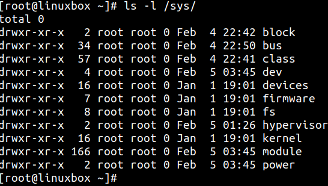
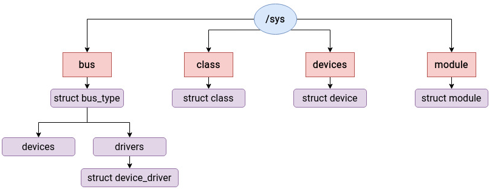
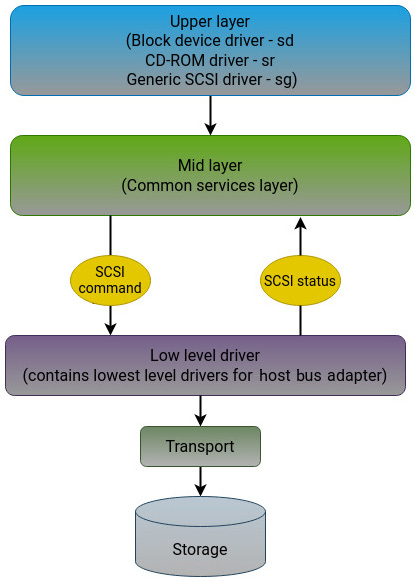
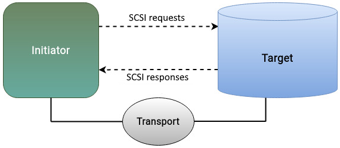
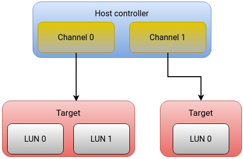
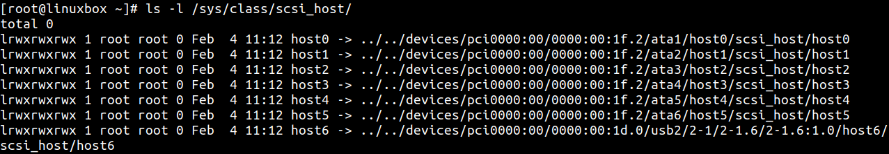
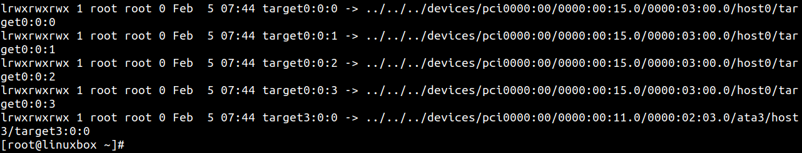
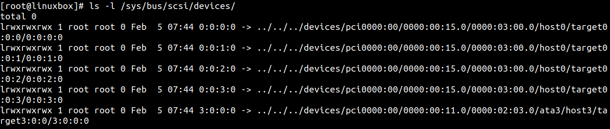
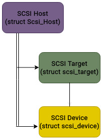
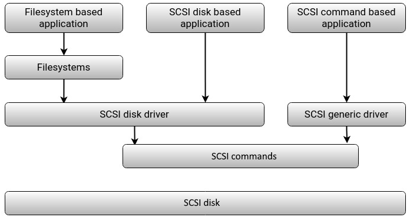

# SCSI 子系统

在前几章中，我们沿着 Linux 存储栈从上往下走：先看 VFS，再看真实文件系统，再进入块层的数据结构与调度。  
到了这一章，我们开始进入“物理层接口”视角：SCSI。

SCSI（Small Computer System Interface）长期以来都是主机与外设通信的重要标准。  
对存储场景来说，上层传下来的读写请求会被转换为等价的 SCSI 命令，再由下层驱动和控制器发往目标设备。

需要注意：SCSI 负责“命令与通信”，不负责文件系统层的块组织策略，也不决定数据在磁盘上的逻辑布局。

本章主要内容：

- Linux 设备驱动模型（Device Model）
- SCSI 子系统分层架构
- Initiator/Target（客户端-服务端）模型
- HBTL 寻址方式
- 关键内核结构与块层协作路径

### 技术要求

建议具备以下基础：

- 磁盘与控制器的基本概念
- Linux 内核分层和驱动模型的入门认知

文中命令与发行版无关，可在 Debian、Ubuntu、Red Hat、Fedora 等系统运行。  
内核源码可从 <https://www.kernel.org> 获取。

## 设备驱动模型

Linux 内核包含大量子系统（系统调用、VFS、进程管理、内存管理、网络栈等）。  
存储 I/O 虽然是我们的主线，但真实请求路径会穿过多个子系统。

如果每类硬件都用完全独立的管理框架，内核会变得臃肿且难维护。  
Linux Device Model 的目标是抽取共性、统一抽象接口，让不同设备在“统一范式”里被管理。

设备模型核心关注点：

- 系统中有哪些设备
- 它们挂在哪条总线
- 对应哪个驱动
- 整体层级关系如何组织

它主要通过以下实体描述硬件世界：

- `Bus`：设备通信通道（例如 PCI、IDE、USB）
- `Device`：挂在总线上的具体硬件
- `Device Driver`：驱动程序，负责初始化与设备交互
- `Class`：按功能归类（例如 SCSI 与 ATA 都可归入磁盘类）

在用户态中，设备模型主要通过 `sysfs` 暴露（挂载点 `/sys`）：

常见目录含义：

- `block`：系统内块设备（磁盘、分区）
- `bus`：设备连接总线类型
- `class`：驱动分类
- `devices`：设备层级结构
- `firmware`：固件相关信息（含 ACPI）
- `fs`：已挂载文件系统相关信息
- `kernel`：内核状态信息
- `module`：已加载模块
- `power`：电源管理信息

设备模型内部有大量结构体，但“粘合剂”角色是 `kobject`。  
上层最常见的结构包括：

- `struct bus_type`
- `struct device`
- `struct device_driver`

## 解释 SCSI 子系统

“SCSI”通常有两层含义：

- 一类硬件连接/传输体系
- 一套与设备通信的命令协议

早期常见并行 SCSI 总线；后来逐步演进到串行接口（如 SAS、Fibre Channel），并扩展出 iSCSI（基于 TCP/IP）。

在 Linux 存储栈里，SCSI 处于块层与具体设备驱动之间的重要桥位：  
把上层 I/O 语义转成可下发的设备命令，并处理返回状态。

### SCSI 三层架构

SCSI 子系统通常按三层理解：

- 上层（Upper layer）：面向用户空间和上层子系统的设备类型驱动
- 中层（Mid layer）：SCSI 核心通用逻辑
- 下层（Lower layer）：最贴近硬件的适配器/HBA 驱动

### 上层（Upper layer）

常见驱动：

- `sd`：磁盘驱动
- `sr`：光驱驱动
- `sg`：通用 SCSI 驱动

你看到的设备名往往与驱动前缀呼应（例如 `sda`）。  
上层负责接收来自更高层（VFS/文件系统等）的请求，并配合中层、下层完成 SCSI 命令提交流程。

代码位置示例：`linux/drivers/scsi/sd.c`

### 中层（Mid layer）

中层是 SCSI 公共核心，负责把上下层“缝合”起来。  
关键职责包括：

- 命令排队（queueing）
- 错误处理与重试
- 电源管理协作
- 将上层请求转换并下发至对应下层驱动

代码位置示例：`linux/drivers/scsi/scsi.c`

### 下层（Lower layer）

下层驱动最靠近硬件，通常是厂商相关实现，直接对接控制器/HBA。  
例如某些 FC HBA 驱动（如 `lpfc`）就属于这一层。

## 客户端-服务端模型（Initiator/Target）

从交互模式看，SCSI 很像客户端-服务端：

- 发起方（主机侧）称为 `Initiator`
- 目标方（存储侧）称为 `Target`

上层应用触发 I/O 后，主机侧 SCSI 发起命令，目标设备执行并回报状态。

Target 既可能是单盘，也可能是 RAID 控制器后面的逻辑目标。  
中间需要传输层承载命令（如 SAS、FC、iSCSI）。

## 设备寻址：HBTL

Linux 常用四段式地址标识 SCSI 设备：`Host:Bus:Target:LUN`。  
`lsscsi` 输出里常见类似 `[0:0:0:0]` 的形式。

字段含义：

- `Host`：主机适配器/HBA 编号（内核按发现顺序分配）
- `Bus`：该控制器下的通道编号
- `Target`：该通道上的目标设备编号
- `LUN`：目标中的逻辑单元编号（常由存储侧定义）

在 `sysfs` 里可以看到对应层级：

- `/sys/class/scsi_host/`（Host）
- `/sys/bus/scsi/devices/targetX:Y:Z`（Target）
- 具体 LUN 节点（四段式地址）

## 主要数据结构

SCSI 相关结构很多，这里聚焦最关键三类：

- `Scsi_Host`：对应 HBA/控制器
- `scsi_target`：对应挂在控制器上的目标设备
- `scsi_device`：对应目标中的具体 LUN

这三者形成层级关系，支撑命令定向、状态跟踪与错误处理。

## 与 SCSI 设备通信的三种方式

- 基于文件系统：最常见，应用通过文件系统接口访问设备
- RAW 设备方式：更直接访问设备（例如 `dd`），但仍经过块层
- Pass-through：应用直接下发 SCSI 命令（如 `sg3_utils` 工具集）

## SCSI 与块层的协作路径

简化流程如下：

1. 文件系统发起读写请求，块层构造对应 SCSI CDB（Command Descriptor Block）。
2. SCSI 中层接收命令并完成排队、错误处理、数据传输协作。
3. 中层将命令转发到目标 HBA 对应的下层驱动。
4. 下层驱动与设备交互后返回完成状态给中层。
5. 中层回传给块层，块层据此更新 I/O 状态并通知文件系统成功或失败。

这条链路体现了 Linux 存储栈“分层抽象 + 协同执行”的核心思想：  
上层关注语义和数据组织，下层关注协议与硬件交互。

## 总结

本章先通过 Linux Device Model 建立了“统一设备抽象”的背景，再进入 SCSI 子系统本体。  
SCSI 既是接口标准，也是命令协议；它在 Linux 中承担“块层请求到设备命令”的关键翻译与传递职责。

在术语上，主机侧是 `Initiator`，设备侧是 `Target`。  
通过 HBTL 四段式地址、`Scsi_Host/scsi_target/scsi_device` 结构和三层驱动架构，内核得以高效地管理复杂存储设备。

下一章会继续进入物理介质本身，对 HDD、SSD、NVMe 的结构与差异展开说明。
