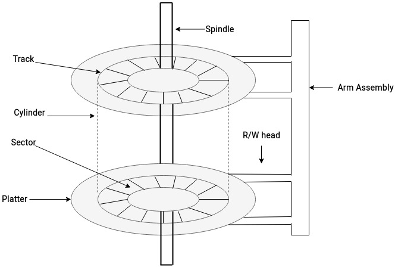
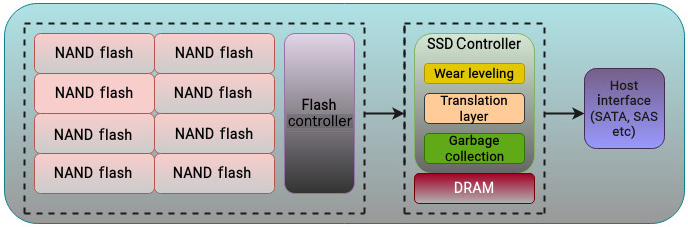
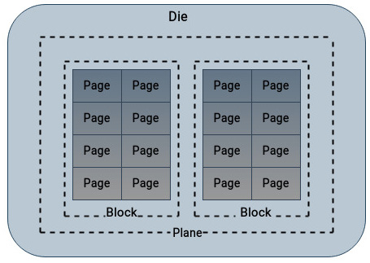
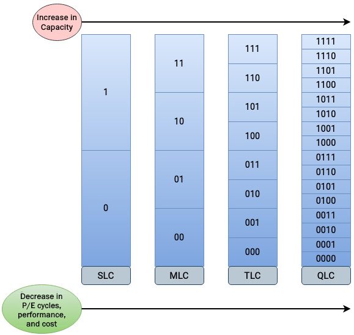
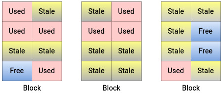
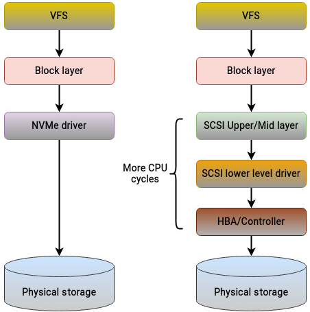

# 图解物理介质布局

> “如果我问人们想要什么，他们会说想要更快的马。” —— Henry Ford

在本书前七章中，我们已经沿着 Linux 存储栈从上到下梳理了软件侧：存储层级如何组织，不同层如何抽象，块设备如何表示，以及 SCSI 子系统如何把块层请求转成设备命令。现在可以暂时离开软件抽象，向下看看真正承载数据的物理介质。

理解不同介质的内部结构很重要。它不仅能解释为什么 Linux 块层需要合并、排序、插塞、多队列和调度器，也能解释为什么同样是“磁盘”，HDD、SATA SSD 和 NVMe SSD 的行为会完全不同。

近些年，存储硬件选择越来越多：企业阵列可以混合不同介质，个人电脑也能在容量、成本、性能之间做取舍。有些场景重容量，有些场景重低延迟和高吞吐。不同介质适合不同工作负载。

本章主要内容：

- 机械硬盘的结构、寻址和性能瓶颈
- SSD 的内部结构、寻址、读写、擦除和垃圾回收
- 驱动器耐久性指标
- NVMe 如何释放 SSD 的性能潜力

## 技术要求

本章内容基本与操作系统无关，不依赖特定 Linux 命令。理解本章只需要具备常见存储介质的基本概念。

## 理解机械硬盘

机械硬盘也叫硬盘、磁盘、旋转磁盘或机械盘。它是现代计算机系统中少数仍带有明显机械结构的部件之一。

本书前面多次把机械盘称为慢速或传统设备，但它并没有退出历史舞台。由于单位容量成本低、容量大，机械盘在企业环境中仍然很常见，只是角色更多转向冷数据、归档数据和容量型存储。对性能敏感的热路径通常会使用 SSD 或 NVMe SSD。

机械硬盘的主要组成部分包括：

- 盘片（platter）：硬盘由多个薄圆盘组成，数据记录在盘片表面。为了提高容量，盘片上下两面通常都可读写。硬盘总容量由盘片数量、单面容量和记录密度共同决定。
- 主轴（spindle）：主轴电机带动所有盘片以恒定速度旋转。常见转速包括 5,400 rpm、7,200 rpm、10,000 rpm 和 15,000 rpm。由于所有盘片连接到同一个主轴，它们会同时以相同速度旋转。
- 读写磁头（R/W head）：数据并不是“刻”在盘片上，而是通过磁信号方向表示。写入时，磁头改变盘片表面的磁化方向；读取时，磁头检测这些磁化状态。每个盘片通常有两个读写磁头，分别对应上下两面。磁头工作时并不会直接接触盘片表面。
- 致动臂（actuator arm）：致动臂负责承载并移动读写磁头，将磁头定位到要读写的位置。
- 控制器（controller）：磁盘控制器负责协调上述组件，并与主机系统交互。它接收主机指令，管理磁头，控制致动臂，并处理地址转换、坏扇区重映射等工作。

## 查看物理布局和寻址

硬盘几何结构描述数据在盘片上的组织方式。盘片表面会被划分为一圈圈同心圆，称为磁道（track）。多个盘片上相同编号磁道组成一个柱面（cylinder）。每条磁道又被切分成更小的扇区（sector）。

扇区是硬盘上最小的可寻址物理单位。第三章中讨论过文件系统块（block），它通常由多个扇区组成，是文件系统层面的概念；扇区则是设备物理属性，通常由厂商在低级格式化阶段确定。传统扇区大小多为 512 字节，现代硬盘也常见 4 KB 扇区。



早期硬盘常用 CHS（Cylinder、Head、Sector）方式寻址，即通过柱面号、磁头号和扇区号组合定位物理位置。使用 CHS 时，操作系统需要了解磁盘的几何参数。

如今 CHS 已经基本被 LBA（Logical Block Addressing，逻辑块寻址）取代。LBA 使用线性地址空间，把每个扇区映射成一个从 0 开始递增的逻辑编号。主机只需要看到一块连续的大设备，具体如何把 LBA 翻译成内部物理位置，则由磁盘控制器完成。

## 坏扇区

坏扇区或坏块是指设备上不能再可靠读写的区域。它可能已经损坏，也可能数据校验不一致。遇到坏扇区时，磁盘控制器通常会把对应逻辑扇区重映射到另一个可用物理扇区，这个过程可以对主机操作系统透明。

坏扇区大体可以分为两类：

- 硬坏扇区：通常来自物理撞击、介质损伤或制造缺陷。这类错误通常不可纠正，该扇区不应再用于存储数据。
- 软坏扇区：通常由操作系统或设备发现某个位置的数据与 ECC（Error-Correcting Code）不匹配。比如应用读取某扇区时，发现 ECC 与内容不一致，就可能说明该位置存在软错误。软错误在某些情况下可以通过重写、重映射或修复流程处理。

## 查看硬盘性能

讨论机械盘性能时，经常会提到寻道时间（seek time）。寻道时间是指读写磁头移动到目标磁道所需的时间。随机访问对机械盘非常昂贵，因为磁头需要频繁移动。寻道时间越低，I/O 请求被服务得越快。

磁头移动到正确磁道后，还需要等待目标扇区旋转到磁头下方，这段时间称为旋转延迟（rotational latency）。旋转延迟取决于主轴转速：转速越高，平均旋转等待越低。如果请求落在相邻扇区，延迟会更低；如果请求随机分布，延迟会更高。

因此，机械盘访问延迟主要来自两部分：

- 磁头移动到目标磁道的寻道时间
- 盘片旋转到目标扇区的旋转延迟

启动程序、加载文件或处理随机 I/O 时，设备可能需要从很多不同位置读数据，这会带来多次寻道和旋转等待。

## 机械硬盘的瓶颈在哪里

从诞生之初起，机械硬盘就不可能在速度上追上 CPU。机械盘响应时间通常以毫秒计算，而 CPU 操作常以纳秒计量。机械结构本身就是性能上限。

厂商当然尝试过改进机械盘：

- 增加磁盘缓存
- 提高主轴转速，从几百 rpm 提升到 15,000 rpm
- 使用更小盘片以降低寻道距离
- 改善控制器和固件调度策略

这些措施都提升了机械盘性能，但只要读写仍然依赖磁头移动和盘片旋转，就无法消除机械延迟。

机械盘性能强烈依赖访问模式：

- 顺序 I/O：性能较好，因为磁头移动少，盘片旋转等待可预测。
- 随机 I/O：性能明显下降，因为磁头需要频繁移动，盘片也要反复等待目标扇区到位。

即便如此，机械盘仍然是企业存储的重要组成部分。对容量敏感、对延迟不敏感的场景中，它的单位 GB 成本优势非常明显。

## 解释固态硬盘架构

SSD 的出现让企业存储性能发生了巨大跃升。SSD 基于半导体材料，没有机械部件，使用非易失性存储芯片保存数据。因此，它天然避开了机械盘的寻道和旋转延迟，速度远高于机械盘。

SSD 通常使用 flash memory 保存数据，常见类型包括 NAND flash 和 NOR flash。大多数 SSD 使用 NAND flash，因为它写入和擦除速度更好。NAND flash 由浮栅晶体管构成，电子存储在浮栅中。浮栅是否带电决定单元中存储的值。

SSD 的主要结构如下：



SSD 控制器负责向主机呈现 NAND flash 的原始存储能力，同时隐藏内部复杂性。

## 查看 SSD 的物理布局和寻址

SSD 中的 NAND flash 通常包含以下层次：

- Gate：浮栅晶体管中的栅结构负责电荷的导通、保持和释放。
- Cell：cell 是最基本的存储单元，电荷状态表示一个或多个 bit。
- Byte：一个字节由 8 个 cell 组成。
- Page：page 类似于硬盘中的扇区，是 SSD 中最小的读写单位。典型 page 大小为 4 KB，也可能更大。
- Block：block 由多个 page 组成。SSD 擦除以 block 为单位执行，因此同一个 block 内的 page 会一起被擦除。

SSD 内部通常按 cell -> page -> block -> plane -> die 组织。一个 die 往往包含多个 plane。



SLC、MLC、TLC 和 QLC 描述每个 cell 存储多少 bit：

- SLC（Single-Level Cell）：每个 cell 存 1 bit，只需区分 0 和 1。
- MLC（Multi-Level Cell）：每个 cell 存 2 bit，需要区分 00、01、10、11 四种状态。
- TLC（Triple-Level Cell）：每个 cell 存 3 bit，需要区分 8 种状态。
- QLC（Quad-Level Cell）：每个 cell 存 4 bit，需要区分 16 种状态。

每个 cell 存储的 bit 越多，容量越高，但状态区分越复杂，性能和耐久性通常会下降。



和机械盘一样，SSD 也向主机暴露 LBA，但内部多了一层 FTL（Flash Translation Layer，闪存转换层）。FTL 把主机看到的逻辑块地址映射到 NAND flash 内部的物理 page。它隐藏 NAND 的内部复杂性，只向操作系统暴露类似传统磁盘的一组逻辑地址。这样做是有意为之，因为操作系统侧很多存储栈设计最初都是围绕机械盘建立的。

## 查看 SSD 的读取与写入

机械盘把扇区作为读、写、擦除等操作的基本单位；SSD 则不同：

- 读以 page 为单位
- 写以 page 为单位
- 擦除以 block 为单位

SSD 中的 page 不能像机械盘扇区那样直接原地覆盖。读取时也无法只读单个 cell，而必须按设备原生 page 大小对齐。例如 page 大小为 4 KB 时，即使只想读取 2 KB，控制器也会读取整个 4 KB page。写入同样按 page 对齐：如果 page 大小为 4 KB，写入 6 KB 数据通常需要占用两个 4 KB page。

## 擦除、垃圾回收和“可用空间”的幻觉

应用向 NAND flash 写数据时，控制器需要为新数据分配空白 page。擦除 NAND flash 需要较高电压，如果以 page 为单位擦除，会影响相邻 cell 并缩短寿命。因此 SSD 使用 block 作为擦除单位。

SSD 寿命常用 P/E cycle（Program/Erase Cycle，编程/擦除周期）描述。一个 block 被写入并擦除一次，就消耗一次 P/E cycle。NAND block 可承受的 P/E cycle 数量是有限的，超过上限后就可能无法可靠保存新数据。

假设某个 page 中的数据需要更新，SSD 不能直接原地覆盖旧 page。常见处理流程是：

1. 控制器把新数据写入其他空白 page。
2. 旧 page 被标记为 stale（过期）。
3. 当需要回收空间时，控制器读取包含有效 page 和 stale page 的整个 block。
4. 有效数据被搬迁到新 block。
5. 原 block 被整体擦除。
6. 新数据和保留数据重新写入。

这会造成写放大（write amplification）：设备内部实际执行的写入量大于主机发起的写入量。



由于擦除只能按 block 进行，SSD 需要额外空间来做数据搬迁、垃圾回收和磨损均衡。用户看到的容量并不是 flash 的全部物理容量。SSD 通常会预留一部分不可见空间，这称为 over-provisioning（预留空间/超额配置）。

这些额外空间可用于：

- 垃圾回收（garbage collection）
- 磨损均衡（wear leveling）
- 坏块替换
- 降低写放大带来的性能抖动

常见 SSD 可能拥有比标称容量多 20% 到 40% 的内部容量。无论个人电脑 SSD 还是企业阵列 SSD，都常使用这种方式提升耐久性和写入性能。

## 查看磨损均衡

由于每个 cell 可承受的 P/E cycle 有限，磨损均衡的目标是让写入尽量均匀分布在不同 page/block 上，避免某些位置被过度使用。

当某个逻辑地址对应的数据需要修改时，控制器会通过 FTL 把该 LBA 重映射到新的物理 block，并把旧数据标记为 stale。旧 block 不必立即擦除。控制器通过这种方式减少单个 cell 被反复擦写的概率，从而延长 SSD 寿命。

如果主机应用频繁更新同一个逻辑位置，而控制器总是反复擦写同一个物理 block，那么该 block 的绝缘层会更快损耗，最终导致 cell 失效。磨损均衡正是为了避免这种热点磨损。

## 查看坏块管理

每个 cell 的 P/E cycle 都有限，因此 SSD 控制器需要跟踪哪些 block 已经不能继续编程或擦除。一旦 block 变得不可用，它会被记入坏块表。

如果坏 block 中仍有有效数据，控制器会先把这些数据复制到新的 block，然后更新坏块表和地址映射。坏块管理与预留空间、FTL、垃圾回收一起，构成了 SSD 控制器隐藏内部复杂性的关键机制。

## 查看 SSD 性能

NAND flash 让 SSD 非常快。虽然它距离主内存仍然有明显差距，但相比旋转机械盘已经快了多个数量级。由于没有机械部件，SSD 不受寻道时间和旋转延迟限制。机械盘最痛苦的随机访问场景，正是 SSD 的优势场景。

## SSD 的瓶颈在哪里

SSD 也不是无限寿命设备。写入会向浮栅晶体管中存储电子，擦除会释放电压；这一组操作就是 P/E cycle。每次经历 P/E cycle，cell 的绝缘层都会受到轻微损伤。损伤逐渐积累后，绝缘层保持电荷的能力会下降，可能出现电压泄漏和状态误判。到这个阶段，该 cell 就会被视为不可再可靠存储数据。

因此，机械盘通常在耐久性指标上优于 SSD，尤其在长期大量写入场景中更明显。不过这并不意味着 SSD 不适合长期使用。现代 SSD 的寿命通常足够长，也有大量工具可以查看健康度和磨损程度。

常见操作单位对比如下：

| 驱动器类型 | 操作 | 基本单位 |
|---|---|---|
| 机械硬盘 | 读 | 扇区 |
| 机械硬盘 | 写 | 扇区 |
| 机械硬盘 | 更新 | 扇区 |
| 机械硬盘 | 擦除 | 扇区 |
| 机械硬盘 | 坏块管理 | 扇区 |
| SSD | 读 | Page |
| SSD | 写 | Page |
| SSD | 更新 | Block |
| SSD | 擦除 | Block |
| SSD | 坏块管理 | Block |

表 8.1：SSD 与 HDD 的操作单位

总体来说，SSD 在性能上显著优于机械盘，拥有更低延迟，也推动应用进入新的性能区间。SSD 结构和内部策略比机械盘复杂得多，成本也更高，但除价格和写入寿命外，几乎在所有性能方面都优于机械盘。

## 理解驱动器耐久性

无论机械盘还是 SSD，厂商通常都会给出耐久性指标。耐久性可以关联多个方面，例如最大性能、工作负载上限、平均故障间隔时间（MTBF，Mean Time Between Failures）等。由于机械盘和 SSD 原理完全不同，它们的耐久性计量方式也不同。

SSD 的耐久性与 NAND 可承受的 P/E cycle 数量直接相关。一旦 cell 到达 P/E cycle 上限，就可能变成缺陷单元。注意，NAND cell 主要在写入和擦除时磨损，读操作带来的磨损通常可以忽略。

SSD 常见耐久性指标包括：

- DWPD（Drive Writes per Day）：在质保期内，每天可以把整块 SSD 完整写满多少次。
- TBW（Terabytes Written）：在整个寿命/质保范围内，允许写入的总数据量。

例如，一块 100 GB SSD，质保期 3 年，DWPD 为 1，则表示 3 年内每天可写入 100 GB：

```text
100 GB x 365 天 x 3 年 ≈ 109 TB
```

也就是说，它的 TBW 大约是 109 TB。

机械盘不同于 SSD。机械盘盘片表面支持直接覆盖写入，不受 P/E cycle 限制。SSD 的耐久性主要受写入影响，读操作影响很小；机械盘则读写都会造成机械部件活动，因此读写都可能影响整体寿命。机械盘厂商也会用每年可读写数据量这类指标来描述工作负载上限。

| 驱动器类型 | 工作负载指标 | 操作 | 对耐久性的影响 |
|---|---|---|---|
| 机械硬盘 | DWRPD / 年度读写工作负载 | 读 | 降低 |
| 机械硬盘 | DWRPD / 年度读写工作负载 | 写 | 降低 |
| SSD | DWPD / TBW | 读 | 影响可忽略 |
| SSD | DWPD / TBW | 写 | 降低 |

表 8.2：驱动器耐久性

不同厂商的质保值会不同。检查耐久性时，DWPD、TBW 本身只是数字，还必须结合质保期理解。例如同样是 DWPD=1，质保 1 年和质保 5 年对应的总可写入量完全不同。

## 用 NVMe 重新发明 SSD

访问机械盘和 SSD 可以使用多种传输协议，例如 SATA、SCSI 和 SAS。这些协议最初主要为机械盘设计，因此它们更适合旋转介质的能力模型。SSD 出现后，早期 SSD 也沿用了 SATA 或 SAS 接口，像机械盘一样插入系统，由传统控制器和协议访问。

SSD 本身性能大幅提升，但如果继续使用为机械盘设计的接口、协议和命令集，就会产生额外开销，并限制 flash 设备释放全部潜力。

NVMe（Non-Volatile Memory Express）正是为 NAND flash 等技术设计的接口和协议。NVMe 经常被误认为是一种新硬盘类型，但严格来说它不是一种介质，而是 SSD 的存储访问和传输协议。它直接运行在 PCIe 接口之上。

需要记住一句话：

> 每块 NVMe 盘都是 SSD，但不是每块 SSD 都是 NVMe 盘。

标准 SSD 可以使用 SATA 或 SAS 接口，并由操作系统通过传统 SCSI 协议访问。NVMe SSD 则通常使用 M.2 等物理形态，逻辑接口是专为这类设备开发的 NVMe，并通过 PCIe 与主机通信。操作系统侧也使用独立的驱动和协议访问 NVMe 设备。

NVMe 绕过了传统 SSD 的路径，直接通过 PCIe 连接到 CPU。存储与 CPU 之间的信号路径越短，性能越好。PCIe 存储设备通常使用多条 lane，带宽远高于单 lane SATA 连接。NVMe SSD 与 PCIe 结合后，性能获得数量级提升。

性能提升不仅来自硬件，软件栈也必须针对硬件优化。SATA 和 SAS 接口通常分别支持单队列中的 32 个和 256 个命令，而 NVMe 可以支持 64,000 个队列，每个队列又可支持 64,000 条命令。这个差距非常巨大。

NVMe 还拥有独立命令集，不同于旧的 SATA/SCSI 协议。旧协议主要为机械盘设计，软件路径更重；NVMe 命令数量较少，处理 I/O 请求时消耗的 CPU 周期也更少。

由于 NVMe 同时定义通信接口和存储呈现方式，软件栈可以用一个更直接的驱动模型控制设备。而在传统协议中，不同设备和厂商常常需要额外驱动或适配层来支持完整功能。



在性能方面，NVMe SSD 通常能提供当前 SSD 中最高的传输速度。其读写性能明显优于标准 SATA/SAS SSD。由于 NVMe 接口和协议的目标就是充分利用 SSD 能力，它的价格通常也高于标准 SSD。

## 总结

本章离开了前面大部分软件侧内容，专门观察实际物理硬件。这里的很多知识与平台无关：硬件能力本身是固定的，能否发挥出来则取决于软件栈如何驱动它。

我们讨论了今天最常见的三类存储选项：机械硬盘、SSD 和 NVMe SSD。

机械硬盘是最古老也仍然广泛存在的存储介质之一。它经历过缓存、转速、盘片尺寸和控制器等方面的改进，但由于仍然依赖机械结构，性能存在天然上限。主轴电机和磁头移动不可能无限变快。

SSD 没有机械部件，使用 NAND flash 持久化数据，因此相比旋转盘快得多。但 SSD 的写入和擦除会消耗 P/E cycle，因而存在有限寿命。SSD 内部还需要 FTL、垃圾回收、磨损均衡、坏块管理和预留空间来维持性能与耐久性。

早期 SSD 仍然受到传统机械盘协议和接口的限制。NVMe 出现后，这个限制被显著缓解。NVMe 为 NAND flash 设计，是 SSD 的存储访问和传输协议，直接运行在 PCIe 之上，因此比传统 SATA/SAS SSD 快得多。

到这里，本书第三部分也结束了。下一部分将进入性能分析和故障排查，讨论用于观察、分析和优化存储性能的工具与技术。
