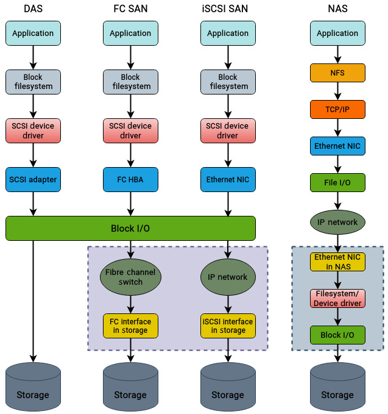
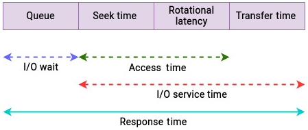
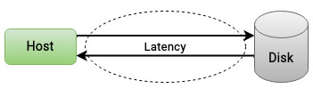
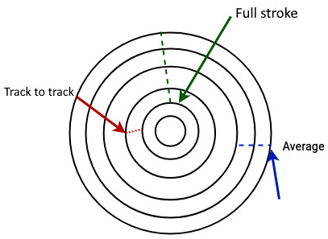
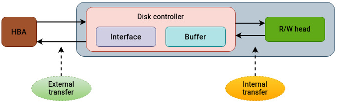
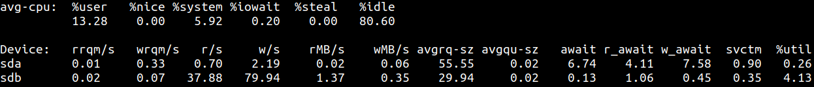
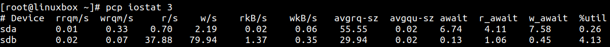
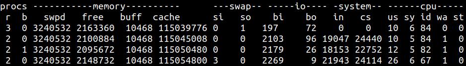

# 分析物理存储性能

> “当你排除了不可能，剩下的无论多么不可能，都必然是真相。” —— Sir Arthur Conan Doyle

前面八章已经从概念和结构上梳理了 Linux 存储栈：应用请求如何穿过 VFS、文件系统、页缓存、块层、SCSI/NVMe 等多个层级，最终到达底层介质。现在可以把这些理解用于更实际的问题：如何判断存储性能是否正常？如何定位瓶颈？

I/O 栈很像网络中的 OSI 模型：每一层都有自己的职责，也有自己的数据单元和处理开销。一个看似简单的应用读写请求，实际会经过许多层转换、排队、缓存、调度和设备处理。性能问题也可能发生在其中任意一层。

存储性能分析之所以困难，是因为计算、内存和存储之间天然存在巨大的速度差距。CPU 和内存操作通常以纳秒计，而存储设备响应通常以毫秒计。某些指标在一个环境中完全正常，在另一个环境中却可能意味着故障。因此，性能分析必须结合工作负载、拓扑和业务预期一起判断。

本章聚焦物理存储层，主要内容包括：

- 如何衡量性能
- 理解存储拓扑
- 分析物理存储
- 使用磁盘 I/O 分析工具

## 技术要求

本章比前几章更偏实践，需要基本 Linux 命令行和系统管理经验。许多工具用于资源监控和性能分析，通常需要 root 或 sudo 权限。

Debian/Ubuntu 上安装 `iostat` 和 `iotop`：

```bash
apt install sysstat iotop
```

Fedora/Red Hat 上安装：

```bash
yum install sysstat iotop
```

Performance Co-Pilot（PCP）的安装可参考官方文档：

```text
https://pcp.readthedocs.io/en/latest/HowTos/installation/index.html
```

这些工具在不同 Linux 发行版上的基本用法是一致的。

## 如何衡量性能

评估系统性能可以从很多角度入手。早期常见做法是把系统性能简单等同于 CPU 性能。但从单处理器时代到现代多插槽、多核系统，CPU 性能已经大幅提升，而磁盘性能并没有以相同速度增长。

存储设备响应时间通常以毫秒计，CPU 和内存则常以纳秒计。这造成了应用需求与底层存储能力之间的不匹配。系统整体性能也像一条链子，强度取决于最弱的一环。对很多系统而言，存储就是那个最慢的环节。

许多工具只关注磁盘本身，而无法直接揭示文件系统、块层、调度器或缓存的表现。为了便于分析，可以把存储性能分析拆成两部分：

- 物理存储分析
- I/O 栈上层分析，例如文件系统和块层

本章关注第一部分：物理存储。文件系统和块层会在下一章继续讨论。

## 理解存储拓扑

企业环境中通常会混用多种存储形态。常见类型包括：

- DAS（Direct Attached Storage，直连存储）：最常见，直接连接到系统，例如笔记本内部硬盘。数据中心中的直连存储通常由多块磁盘组成 RAID，以提升性能和数据保护能力。
- FC SAN（Fibre Channel Storage Area Network）：基于 Fibre Channel 的块级存储网络。它让服务器访问外部存储设备，性能高、响应时间低，常用于关键业务应用。但它成本较高，需要 FC HBA、FC 交换机和存储阵列等专用硬件。
- iSCSI SAN：同样是块存储协议，但通过现有 TCP/IP 网络传输 SCSI 包。相比 FC SAN，iSCSI 性能通常较低，但部署更简单，成本也更低，不需要专用适配器和交换机。
- NAS（Network-Attached Storage，网络附加存储）：文件级存储协议。NAS 同样依赖现有网络，不需要额外专用硬件。由于通过文件级接口访问，性能通常低于块存储，但成本低，常用于长期备份或共享文件场景。

这些拓扑的简化对比如下：



图中没有展开 FC 交换机、SAN 阵列等所有细节。实际排查企业存储环境时，每一层都值得检查。诊断前最好先在脑中或文档中建立清晰拓扑图：主机、HBA、交换机、阵列、卷、RAID、路径和协议分别在哪里。

## 分析物理存储

性能描述的是磁盘设备访问、检索或保存数据的能力。评估磁盘子系统性能有很多指标。存储厂商在宣传高端阵列时常会强调 IOPS，但单独看 IOPS 往往意义不大。

IOPS（Input/Output Operations Per Second，每秒输入输出操作数）如果不结合响应时间、读写比例、吞吐量、I/O 大小等指标，很容易变成“英雄数字”。就像买车不能只看最高时速，还要看加速、油耗、操控和实际道路环境；看存储也不能只看峰值 IOPS。

分析物理磁盘时，先从时间相关指标开始，因为它们能解释时间花在了哪里。凡是看到 latency、delay、wait 这类词，本质上都意味着请求花时间在等待某件事发生。

## 理解磁盘服务时间

物理磁盘性能中最常见的时间指标如下：



需要注意，这些指标只描述物理层附近的时间，不包含文件系统、块层、调度器等内核 I/O 层级中的时间。后续章节会单独分析这些上层开销。

图中的概念可以这样理解：

- I/O wait：I/O 请求可能在队列中等待，也可能正在被设备服务。请求进入磁盘队列后，到真正被分发处理前的等待时间可以理解为 I/O wait。
- I/O service time：磁盘控制器实际服务该 I/O 请求的时间，也就是请求没有在队列中等待，而是在设备上被处理的时间。对机械盘来说，它通常包含：
  - seek time：磁头径向移动到目标磁道所需时间。
  - rotational latency：磁头到达目标磁道后，等待目标扇区旋转到磁头下方的时间。
  - transfer time：磁头就位后，数据在磁盘和主机之间传输所需时间。
- response time / latency：响应时间或延迟，是等待时间和服务时间的总和，可理解为一次 I/O 请求从发起到完成的往返时间。它通常以毫秒表示，是分析存储设备性能时最关键的指标。

磁盘延迟可概括为：



厂商描述机械盘 seek time 时，通常会使用以下几类指标：

- Full stroke：磁头从最内侧磁道移动到最外侧磁道所需时间。
- Average：磁头从一个随机磁道移动到另一个随机磁道的平均时间。
- Track to track：磁头在两个相邻磁道之间移动所需时间。



传输速率又可以拆成内部传输速率和外部传输速率：

- Internal transfer rate：数据从盘片表面传输到磁盘内部缓存/缓冲区的速度。
- External transfer rate：数据进入缓冲区后，通过磁盘接口或协议传输到主机总线适配器的速度。



第 8 章已经解释过，SSD 没有机械结构，因此 seek time 和 rotational latency 这类概念并不适用。对 SSD 来说，通常更关注整体 response time，因为它封装了所有相关时间因素。

## 磁盘访问模式

机械盘最受 I/O 访问模式影响。应用产生的 I/O 通常可分为顺序和随机两类：

- 顺序 I/O：读写连续或相邻磁盘位置。对机械盘来说，顺序 I/O 性能好，因为磁头移动很少，seek time 低。
- 随机 I/O：读写非连续位置。机械盘需要频繁移动磁头，seek time 变长，性能明显下降。

随机 I/O 对旋转机械盘影响最大。SSD 虽然也可能在顺序访问上优于随机访问，但两者差距远小于机械盘。

## 确定读写比例和 I/O 大小

单独看 IOPS 不能完整反映磁盘性能。必须结合 I/O 请求大小和读写比例。

复杂存储系统往往针对特定读写比例和 I/O 大小优化，例如：

- 70/30 read/write
- 32 KB block size

不同应用对底层驱动器有不同预期。在线事务处理（OLTP）应用可能常见 70/30 读写比例；日志类应用可能几乎一直在写，读取较少。

I/O 请求大小同样重要。对于相同数据量，少量大 I/O 和大量小 I/O 的表现可能完全不同：

- 大 I/O 单次处理时间更长，但总请求数少。
- 小 I/O 单次更快，但如果数量很多，排队、调度和响应时间总和可能更高。

因此，分析存储性能时要同时问：请求有多大？读多还是写多？顺序还是随机？

## 磁盘缓存

现代磁盘通常带有板载缓存或缓冲区。磁盘缓存是设备内部的一块内存，用于在主机总线适配器（HBA）和磁盘盘片/flash 之间做缓冲。

缓存对不同 I/O 模式的影响如下：

| I/O 类型 | 读 | 写 |
|---|---|---|
| 随机 | 难以缓存和预取，因为模式不可预测 | 缓存非常有效，因为随机写会带来大量寻道时间 |
| 顺序 | 缓存非常有效，因为数据容易预取 | 缓存有效，且可较快刷出，因为数据写入连续位置 |

表 9.1：缓存对读写的影响

缓存可以加速数据保存和访问。企业存储阵列通常会提供大量缓存，用于吸收突发写入、合并请求和提升读取命中率。

## IOPS 和吞吐量

与延迟一起，IOPS 和吞吐量定义了物理存储的基础性能特征：

- IOPS：单位时间内可以完成多少次 I/O 操作。它反映操作数量。
- Throughput / Bandwidth：单位时间内从磁盘读出或写入磁盘的数据量，通常以 MB/s 或 GB/s 表示。它反映数据体积。

需要牢记：

- IOPS 必须与延迟、读写比例和 I/O 大小一起看。单独看 IOPS 价值很低。
- 处理大量连续数据时，吞吐量可能比 IOPS 更重要。

例如，大文件顺序读写通常关注吞吐量；数据库小块随机读写则更关注 IOPS 和延迟。

## 队列深度

队列深度（queue depth）表示设备一次可以并发处理多少个 I/O 请求。一般情况下默认值就足够，但在大型 SAN 环境中，主机通过 Fibre Channel HBA 连接存储阵列时，队列深度会变成关键参数。

这类环境中可能同时存在多级队列深度：

- 磁盘自身的队列深度
- HBA 的队列深度
- 存储阵列端口的队列深度
- RAID 控制器或虚拟卷的队列深度

如果发出的 I/O 请求数超过设备支持的队列深度，新请求可能不会被接收，设备会向主机返回 “queue full”。等队列有空间后，主机需要重新提交失败请求。

队列深度会影响机械盘和 SSD。SATA 和 SAS 设备通常只支持单队列，常见命令数分别是 32 和 256；NVMe 则可支持 64,000 个队列，每个队列 64,000 条命令。

RAID 控制器也有自己的队列深度，它可能大于底层单盘队列深度之和。因此，不应只看单个设备，还要理解整条路径上的队列限制。

## 判断磁盘繁忙程度

判断磁盘到底有多忙时，常见两个概念：

- Utilization（利用率）：表示给定时间区间内磁盘处于忙碌状态的比例。例如 70% 利用率表示内核观察磁盘 100 次，其中 70 次磁盘正在处理 I/O。100% 利用率表示设备一直在服务请求。但满利用率不一定等于瓶颈，还要结合延迟、队列深度和请求模式。例如请求小且顺序，设备可能仍能及时完成；RAID 阵列也可能并行服务多个请求。
- Saturation（饱和）：表示发往磁盘的请求量已经超过设备实际能力。饱和时，应用必须等待才能读写数据，响应时间上升，系统整体性能受影响。

简而言之：高利用率表示设备忙；饱和表示设备忙到跟不上。

## I/O wait

I/O wait 是性能分析中最容易被误解的指标之一。虽然名字里有 I/O，但它实际上是 CPU 指标，并不直接表示 CPU 性能问题。

I/O wait time 表示 CPU 空闲且系统存在未完成磁盘 I/O 请求的时间比例。难点在于：

- 一个健康系统可能有较高 I/O wait。
- 一个存储已经成为瓶颈的系统，也可能没有明显高 I/O wait。

例如：

- 进程发起 I/O 后，底层磁盘无法立即完成请求，CPU 处于等待状态。这时 CPU 周期被浪费，底层磁盘可能响应较慢。
- 另一个场景中，进程 A 非常消耗 CPU，一直让 CPU 忙碌；进程 B 是 I/O 密集型，占用磁盘。即便磁盘对进程 B 很慢，由于 CPU 没有空闲，I/O wait 也可能很低。因此，低 I/O wait 并不能排除存储瓶颈。

高 I/O wait 可能由以下因素之一或组合导致：

- 物理存储瓶颈
- I/O 请求队列过长
- 磁盘接近饱和或已经饱和
- 进程处于不可中断睡眠状态，即 D state；访问 NFS 等网络文件系统时较常见
- NFS 场景下网络速度较慢
- swap 活动过高

如果存储环境包含完整 SAN 组件，还需要继续检查 FC 交换机、存储阵列和链路上的潜在瓶颈。排查 FC 交换机需要对 FC 协议有基本理解。

## 使用磁盘 I/O 分析工具

现在已经知道要看哪些指标，接下来可以使用 Linux 工具识别这些红旗信号。很多性能问题最初是在应用层被发现的，但真正原因可能在底层。问题还可能是间歇性的，因此需要多种工具交叉观察。

### 使用 top 建立基线

`top` 是排查性能问题最常用的命令之一。它能快速给出系统当前状态，并提示潜在问题。虽然大多数人用它看 CPU 和内存，但其中一个字段可以提示存储问题。

示例输出：

```text
top - 19:11:56 up 96 days, 12:38,  0 users,  load average: 9.44, 6.71, 3.75
Tasks: 498 total,   14 running, 484 sleeping,   0 stopped,   0 zombie
%Cpu(s): 20.6%us,  7.9%sy,  0.0%ni, 13.4%id, 57.1%wa,  0.1%hi,  0.9%si,  0.0%st
KiB Mem : 19791910+total, 10557456 free, 80016952 used, 10734470+buff/cache
KiB Swap:  8388604 total,  5058092 free,  3330512 used. 11555254+avail Mem
```

其中 `wa` 字段表示 CPU 因等待磁盘 I/O 而处于等待状态的时间比例。高 `wa` 往往说明磁盘没有及时响应。负载平均值（load average）也可能因为 I/O wait 升高而上升，因为 load average 会包含等待磁盘的活动。

这里重点关注：

- `wa` 是否持续偏高
- load average 是否异常升高
- 高 `wa` 是否与业务延迟或磁盘指标同步出现

### iotop 工具

`iotop` 类似 `top`，但关注磁盘活动。`top` 默认按 CPU 使用率排序，`iotop` 则按每个进程读取和写入的数据量排序。它展示系统中主要磁盘带宽消费者，也能显示线程/进程在 swap 和等待 I/O 上花费的时间，以及 I/O priority 的 class 和 level。

通常建议使用 `-o` 参数，只显示当前正在执行磁盘 I/O 的进程：

```text
Total DISK READ :       231.10 K/s | Total DISK WRITE :      556.40 K/s
Actual DISK READ:       233.13 K/s | Actual DISK WRITE:      593.72 K/s
  TID  PRIO  USER     DISK READ  DISK WRITE  SWAPIN     IO>    COMMAND
23744 be/2 root        0.00 B/s   519.08 K/s  0.00 %   3.03 %  mysql
10395 be/4 root      231.10 K/s    37.32 K/s  0.00 %   1.58 %  java
```

观察重点：

- 哪些进程读写最多
- 进程吞吐是否接近设备或阵列能力上限
- 是否有异常应用突然大量读写底层磁盘
- `IO>` 是否持续偏高

如果 `iotop` 报告内核未启用 delay accounting，可以启用：

```bash
sysctl kernel.task_delayacct = 1
```

### iostat 工具

`iostat` 是最常用的磁盘分析工具之一，可以显示大量有助于分析性能问题的信息。前面提到的磁盘饱和、利用率、I/O wait 等指标，都可以通过 `iostat` 观察。

`iostat` 磁盘统计输出的第一行通常是自系统最近一次启动以来的平均值；后续行则按照命令行指定的时间间隔显示每秒统计。



观察重点：

- `avg-cpu`：显示 CPU 在各状态下的使用百分比。
- `r/s` 和 `w/s`：每秒发往设备的读请求数和写请求数。
- `avgqu-sz`：处于排队或正在服务状态的操作数。
- `await`：请求进入队列到完成的平均时间。
- `r_await` / `w_await`：读/写请求的平均等待时间。如果持续偏高，设备可能接近饱和。
- `%util`：磁盘至少服务一个 I/O 请求的时间比例。

通常认为设备利用率接近 100% 时就更接近饱和。这个判断适用于代表单块磁盘的设备。但 SAN 阵列或 RAID 卷由多块磁盘组成，可能并行服务多个请求。内核并不知道底层设备内部结构，因此 `%util` 在这些场景下可能具有误导性。

### Performance Co-Pilot

Performance Co-Pilot（PCP）是一个开源框架和工具集，用于监控、分析和响应实时与历史系统性能数据。PCP 中也包含一些分析存储性能的工具。它们与 `sysstat` 包中的工具类似，并提供 GUI 可视化和历史数据保存能力。

对存储分析有帮助的工具包括：

- `pcp atop`：类似 `iotop` 和 `atop`，列出执行 I/O 的进程以及它们消耗的磁盘带宽。它适合快速把握系统中正在发生的变化。
- `pcp iostat`：类似 `iostat`，报告实时磁盘 I/O 统计。



### vmstat 命令

`vmstat` 来自 “virtual memory statistics”，几乎所有 Linux 发行版都自带。它报告进程、内存、分页、磁盘和 CPU 活动。



观察重点：

- `b`：等待资源而阻塞的进程数，例如等待磁盘 I/O 的进程。
- `si`：每秒从 swap 空间读入内存的数据量，单位 KB。值高说明系统频繁从磁盘 swap 读数据。
- `so`：每秒从内存写出到 swap 空间的数据量，单位 KB。值高说明系统内存压力较大，需要把数据换出到磁盘。
- `bi`：从磁盘读入内存的数据传输速率。值高说明读活动增加。
- `bo`：从内存写出到磁盘的数据量。值高说明写活动增加。
- `wa`：CPU 空闲且等待 I/O 完成的时间百分比。值高可能说明存在 I/O 瓶颈或延迟。

`vmstat` 对排查磁盘 I/O 拥塞、过度分页和 swap 活动非常有价值。

### Pressure Stall Index

Pressure Stall Index（PSI）是 Linux 中较新的排障能力，用于获取 CPU、内存和磁盘 I/O 的资源压力指标。当 CPU、内存或 I/O 设备发生争用时，工作负载可能出现延迟尖峰。PSI 可以实时汇总这类等待信息。

PSI 值通过 `/proc` 伪文件系统暴露。全局原始 PSI 值位于 `/proc/pressure/` 目录下，包括 `cpu`、`io` 和 `memory` 文件。

查看 I/O 压力：

```bash
cat /proc/pressure/io
```

示例输出：

```text
some avg10=51.30 avg60=41.28 avg300=23.33 total=84845633
full avg10=48.28 avg60=39.22 avg300=22.78 total=75033948
```

观察重点：

- `avg10` / `avg60` / `avg300`：过去 10、60、300 秒中，进程因缺少磁盘 I/O 资源而被阻塞的时间百分比。
- `some`：至少一个任务因为资源不足而被延迟的时间比例。
- `full`：所有任务都因为资源约束而被延迟的时间比例，表示系统处于完全无产出等待的程度。

这些指标有点类似 `top` 中的 load average。示例中 10、60、300 秒平均值都较高，说明进程正在被 I/O 压力阻塞。

## 总结

性能排障很复杂，因为诊断和分析往往需要较长时间。在存储、计算和内存三大资源中，存储通常最慢。它与 CPU/内存之间天然存在性能不匹配，任何磁盘性能下降都可能影响整个系统。

本章分成两部分。

第一部分介绍了排查存储问题前必须理解的关键指标，包括：

- 存储设备时间相关指标
- CPU I/O wait
- 磁盘饱和与利用率
- 磁盘访问模式
- I/O 大小和读写比例
- 缓存、IOPS、吞吐量和队列深度

第二部分介绍了 Linux 中可用于观察这些指标的工具，包括：

- `top`
- `iotop`
- `iostat`
- Performance Co-Pilot / PCP
- `vmstat`
- PSI

这些工具不仅能用于存储分析，也能帮助建立系统整体状态，包括 CPU 和内存子系统。每个工具都有大量选项，可用于深入分析特定方面。需要记住的是，不同环境变量很多，性能排障没有固定公式，必须结合拓扑、工作负载和多项指标综合判断。

下一章将继续分析存储栈上层，重点关注块层和文件系统，并使用 Linux 中的 tracing 机制观察请求在这些层中的行为。
