# 分析文件系统和块层

读写存储设备通常不会直接到达物理磁盘，而是会穿过多个中间层：应用调用系统调用，VFS 抽象文件操作，具体文件系统组织数据，页缓存暂存数据，块层把请求转换、合并、调度，最后才提交到底层设备。

上一章主要讨论了物理磁盘层的指标，例如 IOPS、吞吐量、延迟、利用率、饱和度和 I/O wait。但如果只看物理磁盘，很容易遗漏真正的延迟来源。应用通常与文件系统交互，而不是直接与物理存储交互。每一层都会引入自己的处理开销，也都可能成为性能问题的来源。

本章将继续向上分析 I/O 栈，重点关注文件系统和块层。主要内容包括：

- 如何调查文件系统和块层
- 文件系统 I/O 的不同类型
- 文件系统延迟来自哪里
- 如何识别目标分析层
- 如何选择合适的工具

## 技术要求

本章会使用 Linux 中的 BPF Compiler Collection（BCC）性能工具。理解这些工具需要具备基本系统管理经验，并了解进程、资源利用率和性能指标。多数工具需要 root 或 sudo 权限。

Ubuntu/Debian：

```bash
sudo apt install strace
sudo apt install bpfcc-tools
```

Fedora/CentOS/Red Hat：

```bash
sudo yum install strace
sudo yum install bcc-tools
```

## 调查文件系统和块层

存储比系统中很多组件都慢，因此性能问题经常与 I/O 有关。但简单地说“这是 I/O 问题”过于粗糙。

文件系统是应用接触存储的第一层，夹在应用和物理存储之间。传统性能分析常把注意力集中在物理磁盘，例如磁盘利用率、吞吐量和延迟，而忽略一次 I/O 请求在文件系统、VFS、页缓存、块层和调度器中的变化。

上一章介绍的很多工具会在固定时间窗口内给出平均值，这也可能误导判断。例如某应用 10 秒内产生如下 I/O 请求：

| 秒 | 请求数 | 秒 | 请求数 |
|---|---:|---|---:|
| 1 | 10 | 6 | 20 |
| 2 | 15 | 7 | 5 |
| 3 | 500 | 8 | 15 |
| 4 | 20 | 9 | 8 |
| 5 | 5 | 10 | 2 |

表 10.1：I/O 请求的平均统计

如果每 10 秒采样一次，平均每秒请求数是 60。这个平均值看起来可能正常，却完全掩盖了第 3 秒附近的突发 500 次请求。磁盘级统计工具通常无法提供每个 I/O 请求级别的细节。

要更准确地分析 I/O 问题，通常需要观察以下层级：

- 系统调用和库调用：应用通过系统调用请求内核资源，系统调用执行在内核态；库调用执行在用户态。跟踪这些调用可以了解应用行为，例如是否被资源竞争、锁或某类调用阻塞。
- VFS：VFS 是应用和具体后端文件系统之间的通用接口。它把应用文件操作与具体文件系统实现解耦，并包含页缓存、inode 缓存和 dentry 缓存等机制。分析 VFS 有助于判断应用的整体工作负载、操作模式和缓存使用情况。
- 文件系统：不同文件系统组织磁盘数据的方式不同。读写比例、同步/异步操作、I/O 大小、访问模式、cache hit/miss、预读、预取、锁和日志都会影响性能。
- 块层：I/O 请求进入块层后，可能被映射到 LVM、软件 RAID、多路径设备等逻辑设备。RAID 条带化、多路径驱动、映射和队列都可能产生资源竞争。
- 调度器：I/O 调度器会合并、排序或重排请求，从而改变请求最终到达磁盘的顺序。不同调度器适合不同设备和负载。
- 物理存储：这是传统排障中最常关注的层。上一章已经介绍了物理磁盘指标的分析方法。

有些应用会绕过文件系统直接访问设备，这称为 raw access，访问的设备称为 raw device。数据库等大型应用可能使用这种方式，因为文件系统、卷管理器等抽象层都会增加处理开销。绕过文件系统后，应用可以管理自己的缓存，也更容易测试设备原始性能。

影响应用 I/O 性能的因素可以概括如下：

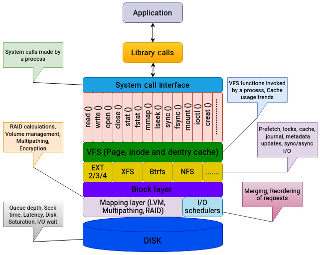

排查性能问题时，第一步是把问题拆小。尽可能移除不必要层级，逐层判断延迟和吞吐瓶颈来自哪里。

## 文件系统 I/O 的不同类型

为了便于讨论，可以把进程发起的 I/O 称为逻辑 I/O，把最终在磁盘上执行的操作称为物理 I/O。二者并不一定相等。

- 逻辑 I/O：应用或文件系统层面发起的读写。
- 物理 I/O：数据在存储设备和内存之间实际传输，通常由磁盘控制器等硬件参与。

一个逻辑 I/O 可能膨胀成多个物理 I/O；反过来，一个逻辑 I/O 也可能完全不触发物理 I/O。常见原因包括：

- 缓存：Linux 大量使用内存缓存数据。如果应用读取的数据已经在缓存中，请求不会触发物理磁盘操作。
- 回写：文件系统写入默认会被缓存。writeback 机制会延迟并合并写操作，之后再刷盘。
- 预取：文件系统可在读取某个块时，把顺序相邻块提前读入缓存。顺序读因此可以非常快，也能减少后续物理 I/O。
- 日志：取决于文件系统日志模式，一次写入可能先写日志，再写真实位置，从而增加物理写次数。
- 元数据：访问或修改文件时，文件系统需要更新时间戳、空闲块计数等元数据，这些变化也可能触发磁盘写入。
- RAID：条带化、奇偶校验、镜像和重建都可能引入额外读写。
- 调度：I/O 调度器可能合并多个请求，因此多个逻辑请求可能变成一个物理请求。
- 数据缩减：如果启用压缩或去重，最终物理 I/O 可能少于应用发起的逻辑 I/O。

因此，不能只看应用层请求数，也不能只看磁盘层请求数。真正的问题往往隐藏在逻辑 I/O 和物理 I/O 的差异中。

## 文件系统延迟来自哪里

第 9 章中已经强调，延迟是性能分析中最重要的指标。从文件系统角度看，延迟可以理解为：逻辑请求发起，到对应物理磁盘操作完成之间的时间。

物理存储瓶颈只是文件系统响应时间的一部分。文件系统不会简单地把 I/O 原样交给磁盘，中间还可能经历多种延迟来源：

- 资源竞争：多个进程并发写同一文件会影响性能。锁用于串行化文件访问，对数据库等大型应用尤其重要。Linux 文件系统通过通用 VFS 方法实现锁。
- 缓存未命中：缓存的目标是避免频繁访问磁盘。如果应用配置为绕过页缓存，或缓存命中率较低，就可能感受到更高延迟。
- 块大小：存储系统通常针对特定块大小工作，例如 8 KB、32 KB 或 64 KB。如果应用发起的 I/O 过大，可能要先拆分成合适大小，这会带来额外处理。
- 元数据更新：文件系统元数据更新可能是主要延迟来源。更新时间戳、块分配信息、目录项等操作都可能涉及寻找磁盘位置、写入数据和同步缓存。
- 逻辑 I/O 拆分：一个逻辑 I/O 可能拆成多个物理 I/O，每个物理操作都需要磁盘访问和处理时间。
- 数据对齐：文件系统分区需要与物理磁盘几何结构正确对齐。分区未对齐会降低性能，RAID 卷尤其明显。

影响 I/O 请求生命周期的因素很多，这也是许多人只看磁盘级统计的原因：磁盘指标更直观。但如果应用对延迟敏感，就必须继续向上看文件系统、VFS、缓存和块层。

## 识别目标分析层

不同层都可以分析，但每层的收益和代价不同：

| 层级 | 优点 | 缺点 |
|---|---|---|
| 应用 | 应用日志、专用工具或调试技术能帮助界定问题范围 | 调试技术不通用，每个应用都不同 |
| 系统调用接口 | 容易跟踪某个进程生成的调用 | 同一功能可能涉及多个系统调用，过滤困难 |
| VFS | 所有文件系统都使用通用调用 | 需要隔离目标文件系统，否则伪文件系统等也会被统计进来 |
| 文件系统 | 应用首先接触文件系统，因此适合作为分析对象 | 文件系统级跟踪机制相对较少 |
| 块层 | 可用跟踪机制多，能观察请求如何被处理 | 调度器等组件可调参数有限 |
| 磁盘 | 分析简单，不需要深入理解上层 | 无法清楚解释应用行为 |

表 10.2：分析不同层级的优缺点

逐层调查当然很费力。拥有专门性能分析团队的企业可能会逐项排查细节，但现实中更常见的做法是直接增加计算资源或迁移到更强硬件，尤其在云环境中更常见。这种方式能快速缓解压力，但也可能掩盖真正的问题。

## 找到合适工具

深入分析应用行为并不容易。I/O 栈中的抽象层很多，每层都有自己的概念。Linux 跟踪机制可以帮助我们了解应用生成的模式，但并不是所有人都能同时掌握应用内部实现和内核 I/O 路径。

如果运行的是关键 OLTP 数据库，每笔交易都有 SLA，那么了解 CPU 时间和 I/O 时间花在哪里很有价值。例如一次事务要求 10 秒完成，如果只有 1 秒花在文件系统和磁盘 I/O 上，存储显然不是主要瓶颈；如果 5 秒阻塞在文件系统层，就需要进一步调优。

下面介绍一些常用工具。注意这不是完整列表，BCC 本身还包含大量工具。这里选择的是适合分析 I/O 栈的代表性工具。

## 跟踪应用调用

`strace` 是 Linux 中最常用的跟踪工具之一，可以显示进程发起的系统调用。它能帮助判断程序时间花在哪些内核函数上。

例如，使用 `-c` 可以生成系统调用汇总，显示每类调用的次数和耗时：

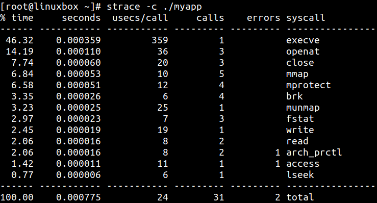

如果只想过滤某个系统调用，可以使用 `-e`：

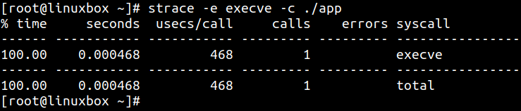

还可以打印时间戳和每个系统调用耗时，并把输出保存到文件：

```bash
strace -T -ttt -o output.txt ./myapp
```

分析 I/O 相关输出时，可以关注 `open`、`read`、`write` 等常见调用。例如某次 `write` 能把 319,488 字节一次性写入缓冲区，耗时 156 微秒：

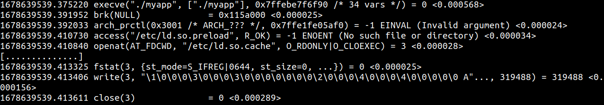

`strace` 也可以附加到正在运行的进程。它的输出通常非常多，因此最好先了解应用最常生成哪些调用。对 I/O 分析来说，重点关注：

- 生成系统调用的摘要
- 各调用执行时间
- 过滤需要关注的调用，例如 `read` 和 `write`

`strace` 不能告诉你操作系统后续如何处理 I/O，但它能告诉你应用向内核发出了什么请求。

## 跟踪 VFS 调用

排查初期，分析 VFS 有助于建立整体工作负载画像，也能判断应用如何使用 VFS 中的缓存。BCC 提供了 `vfsstat`、`vfscount` 等工具，用于观察 VFS 事件。

`vfsstat` 会汇总常见 VFS 调用，例如 `read`、`write`、`open`、`create` 和 `fsync`：

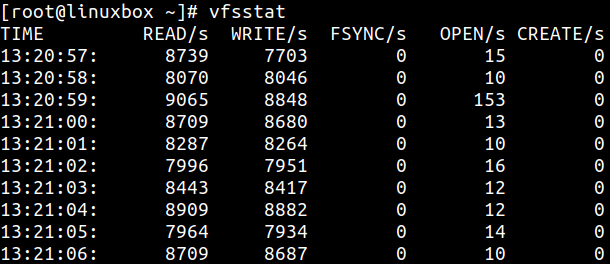

除了 `READ` 和 `WRITE`，也要关注 `OPEN`。它表示每秒打开文件的数量。打开文件数突然增加会显著增加 I/O 请求，尤其会增加元数据操作。

单独运行 VFS 工具可能信息有限。更好的做法是和 `iostat` 等磁盘分析工具一起使用，对比逻辑 I/O 请求和物理 I/O 请求。

`vfsstat` 的限制是不能按文件系统拆分 I/O 活动。`fsrwstat` 可以跟踪读写函数，并按不同文件系统拆分读写调用：

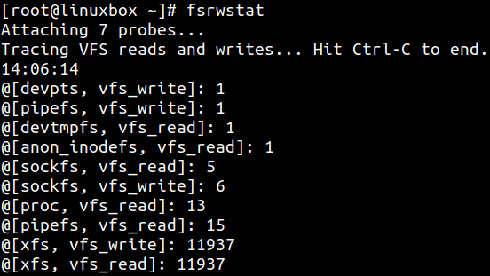

如果 `vfsstat` 显示大量文件被打开，可以进一步使用 `filetop`。它能显示系统中访问最频繁的文件，以及这些文件的读写活动：

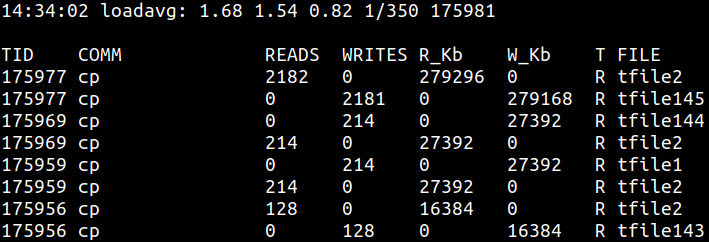

分析 VFS 时，建议：

- 先获得系统整体工作负载画像
- 检查常见 VFS 调用频率
- 将 VFS 层的逻辑请求与物理层请求进行对比

## 分析缓存使用

VFS 包含多个缓存，用于加速频繁访问的对象。Linux 默认会先在缓存中完成写操作，再把数据刷到磁盘。读操作也会尽量从缓存中满足。

`cachestat` 可以显示页缓存命中和未命中统计：

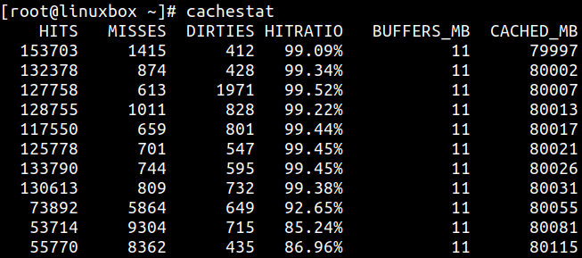

如果 cache hit ratio 接近 100%，说明内核能够从内存满足应用 I/O 请求。命中率越高，应用通常能获得越好的性能。

`cachetop` 则提供按进程划分的缓存命中和未命中统计，界面类似 `top`：

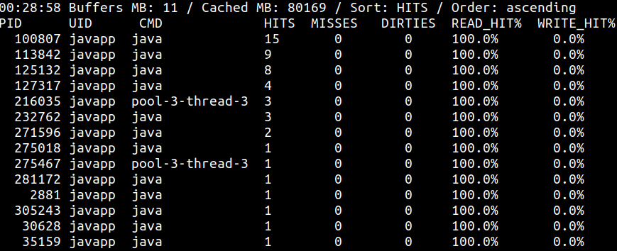

分析缓存时重点关注：

- hit/miss 比例，判断多少请求由内存满足
- 如果命中率偏低，可能需要调整应用或操作系统参数

## 分析文件系统

文件系统级跟踪工具不算多，但 BCC 提供了一些非常实用的脚本。`ext4slower` 和 `xfsslower` 可分别分析 Ext4 与 XFS 上的慢操作。

两者输出形式相同。默认情况下，它们打印耗时超过 10 ms 的操作，也可以传入阈值调整。工具也可以附加到特定进程：

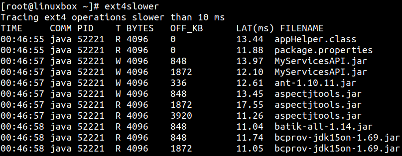

关键列包括：

- `T`：操作类型，`R` 表示 read，`W` 表示 write，`O` 表示 open。
- `BYTES`：I/O 大小，单位字节。
- `OFF_KB`：文件偏移，单位 KB。
- `LAT(ms)`：I/O 请求从 VFS 发往文件系统，到完成之间的耗时。这是应用进行文件系统 I/O 时实际承受延迟的较准确度量。

另外，`xfsdist` 和 `ext4dist` 用于汇总常见文件系统操作耗时，并以直方图方式展示延迟分布。它们分别针对 XFS 和 Ext4，也可以附加到特定进程：

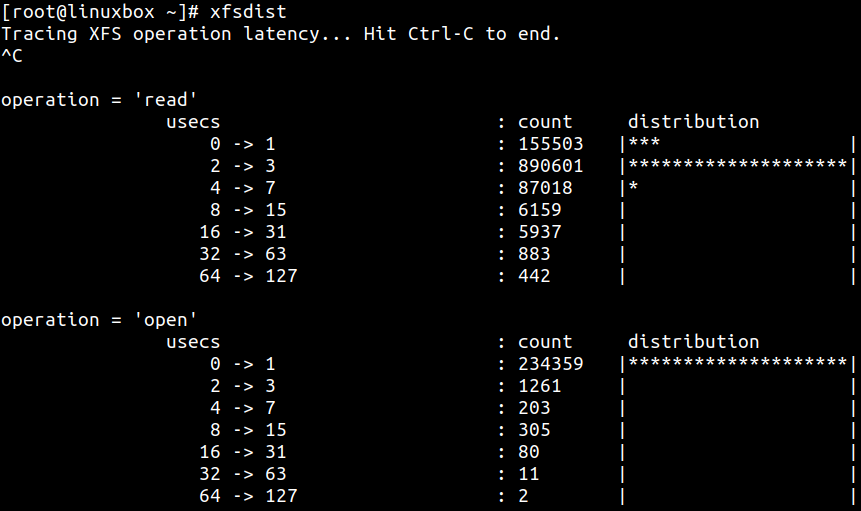

使用文件系统工具时要记住：

- `ext4dist` / `xfsdist` 有助于建立基线，判断负载偏读还是偏写。
- `ext4slower` / `xfsslower` 很适合确定进程执行文件系统 I/O 时实际经历的延迟。重点看 latency 列。

## 分析块 I/O

第 9 章介绍的 `iostat` 等标准磁盘工具能显示每秒读写字节数、磁盘利用率和设备请求队列等指标。但这些指标通常是时间窗口内的平均值，无法解释某个具体 I/O 请求在某个时刻发生了什么。

BCC 也提供了多个工具来观察块层事件。

`biotop` 类似面向磁盘的 `top`。默认情况下，它跟踪块设备 I/O，并每秒按进程汇总活动。输出按磁盘吞吐量排序，进程 ID 和名称表示 I/O 操作最初创建时对应的进程：

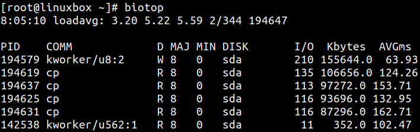

`biolatency` 用于跟踪块设备 I/O 延迟，并输出延迟分布直方图：

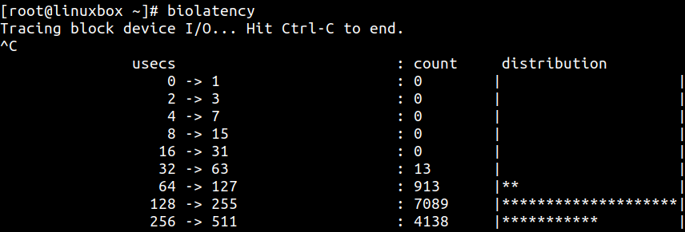

示例中大多数 I/O 请求在 128-255 微秒内完成。实际环境中，该值可能因工作负载和设备状态而高得多。

`biosnoop` 跟踪块设备 I/O，并打印包括发起请求进程在内的详细信息：

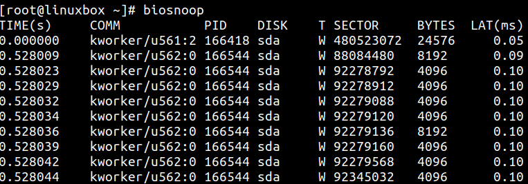

`biosnoop` 输出包含请求从提交到设备到完成之间的延迟。它也可以用来识别哪个进程在对磁盘进行大量写入。

`bitesize` 用于观察块设备 I/O 大小分布：

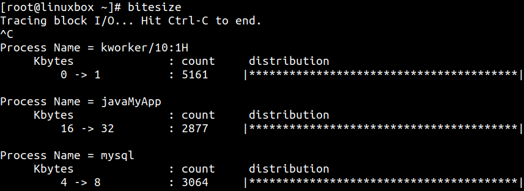

例如，上图中 `javaMyApp` 进程产生 16-32 KB 请求，而 `mysql` 使用 4-8 KB 范围。

分析块层时可以遵循以下思路：

- 使用 `biotop` 获得磁盘活动的高层视图。
- 使用 `bitesize` 跟踪应用 I/O 大小。如果工作负载是顺序型，较大块大小可能带来更好性能。
- 使用 `biolatency` 观察块 I/O 延迟分布。如果延迟较高，需要进一步挖掘。
- 使用 `biosnoop` 查看具体请求细节。若要查看 I/O 请求创建到发给设备之间花费的时间，可使用 `biosnoop -Q`。

## 工具总结

不同层级可使用的工具大致如下：

| 层级 | 分析工具 |
|---|---|
| 应用 | 应用专用工具 |
| 系统调用接口 | `strace`、`syscount`（BCC） |
| VFS | `vfsstat`、`vfscount`、`funccount` |
| 缓存 | `slabtop`、`cachestat`、`cachetop`、`dcstat`、`dcsnoop` |
| 文件系统 | `ext4slower`、`xfsslower`、`ext4dist`、`xfsdist`、`filetop`、`fileslower`、`stackcount`、`funccount`、`nfsslower`、`nfsdist` |
| 块层 | `biolatency`、`biosnoop`、`biotop`、`bitesize`、`blktrace` |
| 磁盘 | `iostat`、`iotop`、`systemtap`、`vmstat`、PCP |

表 10.3：工具总结

工具并不限于表中列出的这些。BCC 工具集本身就包含更多性能分析脚本，每个工具也有很多参数，可以让输出更适合当前问题。由于 I/O 层级很多，诊断 I/O 性能问题通常需要多个团队协作，例如应用、系统、存储和网络团队。

## 总结

本章把性能分析从物理磁盘扩展到了 I/O 栈上层。很多时候，人们只分析物理层，忽略文件系统、VFS、缓存和块层。但对延迟敏感应用来说，必须扩大视角，寻找应用响应时间中真正的延迟来源。

本章首先解释了应用读写文件系统时可能观察到的多种延迟来源。文件系统工作不只包括应用发起的 I/O 请求，还可能包含元数据更新、日志写入、缓存刷盘、预取、回写和 RAID 等额外操作。这些都会引入额外物理 I/O。

上一章的工具主要围绕磁盘，无法充分观察 VFS 和块层内部事件。BCC 提供了丰富脚本，可以跟踪内核中的具体事件，帮助我们理解单个 I/O 请求经历了什么。

下一章将进一步讨论 I/O 层级中可应用的调优手段，以及如何在不同层面改善性能。
