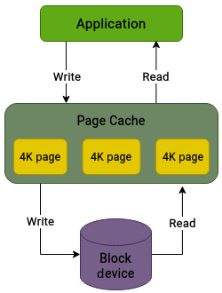
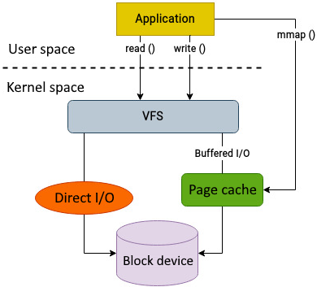
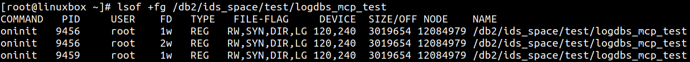

# 调优 I/O 栈

本书已经走到最后一章。前两章重点讨论 I/O 栈的性能分析：第 9 章关注物理磁盘常见指标以及定位物理磁盘瓶颈的工具；第 10 章继续向上，分析文件系统、VFS 和块层等更靠近应用的层次。

性能分析之后，下一步就是性能调优。调优前必须先明确目标，因为调优本质上是在不同目标之间做取舍。例如，为低延迟调优可能会降低整体吞吐量；为了提高吞吐量而积累更多批量写入，也可能增加单次请求的等待时间。因此，在修改系统参数之前，应先建立性能基线，并以小步方式逐项调整、逐项验证。

本章将介绍可以用来改善 I/O 性能的一些常见调优方向，主要包括：

- 内存使用如何影响 I/O
- 调优内存子系统
- 调优文件系统
- 选择合适的 I/O 调度器

## 技术要求

本章内容建立在前面章节的概念之上。如果已经熟悉磁盘 I/O 层级中各层的职责，理解本章会容易很多。具备 Linux 内存管理基础会更有帮助。

本章提到的命令和示例不依赖特定发行版，可以在 Debian、Ubuntu、Red Hat、Fedora 等常见 Linux 系统上运行。文中也会引用部分内核源码相关概念，如果需要查看源码，可以从 https://www.kernel.org 下载。

## 内存使用如何影响 I/O

VFS 是 I/O 请求进入内核文件系统路径的重要入口，其中包含多种缓存，最重要的是页缓存（page cache）。页缓存的目标是提升 I/O 性能，减少 swap 和文件系统操作带来的实际磁盘访问，从而避免不必要的物理 I/O。

Linux 内存管理子系统也称为虚拟内存管理器（Virtual Memory Manager，VMM）。它承担的职责包括：

- 为用户态和内核态应用分配物理内存
- 实现虚拟内存和按需分页（demand paging）
- 将文件映射到进程地址空间
- 在内存紧张时通过裁剪缓存或换出页面释放内存

常见说法是：最好的 I/O 是被避免掉的 I/O。Linux 内核正是沿着这个思路工作：它会尽量使用空闲内存保存各种缓存。可用内存越多，缓存机制越有效。对于多数通用场景，应用执行的是小规模请求，并且系统中存在一定数量的页缓存，缓存可以显著减少访问底层磁盘的次数。



图 11.1：页缓存可以加速 I/O 性能

反过来，如果可用内存很少，缓存不仅会被频繁裁剪，数据还可能被换出到磁盘，最终伤害性能。内核遵循时间局部性原则，也就是最近访问过的数据块更有可能再次被访问。随机从磁盘读取数据可能需要几毫秒，而如果同一份数据已经缓存在内存中，访问通常只需要几纳秒。因此，任何可以直接由页缓存满足的请求，都能显著降低一次 I/O 操作的成本。

## 调优内存子系统

Linux 管理内存的方式会直接影响磁盘性能，这看起来有些奇怪，但非常重要。默认情况下，内核的缓存策略适用于大多数场景。不过，过度缓存也可能带来问题：

- 当内核在页缓存中积累了大量数据，最终开始把这些数据刷写到磁盘时，磁盘可能会长时间忙于大量写操作，从而影响整体 I/O 性能并增加响应时间。
- 内核并不知道页缓存中数据的业务重要性。它不会天然区分重要 I/O 和不重要 I/O，而是根据自身算法选择需要读写的数据块。例如，一个应用同时执行前台和后台 I/O 时，前台 I/O 通常应有更高优先级，但后台任务的 I/O 仍可能压制前台任务。
- 页缓存算法是通用算法，并不是为某个具体应用定制的。多数情况下这没有问题，但对数据库等自带缓存机制的应用来说，内核页缓存可能反而变成额外负担。

数据库等系统通常更了解自己的内部数据组织方式，因此倾向于使用自己的缓存机制来优化读写性能。此时，如果数据先从磁盘进入内核页缓存，再复制到应用自己的缓存中，就会产生额外 CPU 和内存开销。

### 使用 direct I/O

在应用自己负责缓存的场景下，可能希望绕过内核页缓存，把缓存责任交给应用。这就是 direct I/O。

使用 direct I/O 时，文件读写会直接在应用和存储设备之间进行，绕过内核页缓存。Unix 文件系统（UFS，不受 Linux 支持）把 direct I/O 作为文件系统挂载参数；但在 Linux 中，direct I/O 不是文件系统参数，也没有一个统一命令可以全局启用。它由应用发起：应用在 `open()` 等系统调用中使用 `O_DIRECT` 标志，表示打开或创建文件时绕过内核页缓存。



图 11.2：执行 I/O 的不同方式

普通应用通常不应随意使用 direct I/O，因为它可能导致性能下降。但对自带缓存的大型应用来说，它可能带来显著收益。推荐方式是从应用自身检查 direct I/O 状态。如果需要从命令行观察，可以使用 `lsof` 查看文件打开标志。



图 11.3：检查 direct I/O

如果应用通过 `O_DIRECT` 标志打开文件，输出中的 `FILE-FLAG` 列会包含 `DIR` 标志。

Direct I/O 的性能收益主要来自两点：避免把数据从磁盘复制到页缓存的 CPU 成本；避免双重缓存，即同一份数据同时存在于应用缓存和文件系统页缓存中。

### 控制回写频率

缓存可以加速很多文件访问，但当大部分空闲内存都被缓存占用后，内核必须决定如何腾出内存来服务新的 I/O 请求。内核通常采用 Least Recently Used（LRU）思路：淘汰页缓存中的旧数据，并在必要时把部分数据换出到 swap 区域。

默认策略通常足够好，但一些场景需要特别关注：

- 当前缓存中的数据之后可能再也不会访问。备份任务就是典型例子：它会从磁盘读写大量数据，内核会缓存这些数据，但这些缓存很可能短期内不会再次使用。它们却可能挤掉更可能被再次访问的旧页面。
- 把数据换出到磁盘会产生大量磁盘 I/O，不利于性能。
- 页缓存中积累大量脏数据时，如果系统崩溃，可能导致较大规模的数据丢失；对敏感数据而言风险更高。

页缓存不能，也不应该被完全禁用。不过，内核提供了一些参数来控制其行为。这些参数可以通过 `sysctl` 查看：

```bash
[root@linuxbox ~]# sysctl -a | grep dirty
vm.dirty_background_ratio = 10
vm.dirty_background_bytes = 0
vm.dirty_ratio = 20
vm.dirty_bytes = 0
vm.dirty_writeback_centisecs = 500
vm.dirty_expire_centisecs = 3000
```

其中几个关键参数如下：

- `vm.dirty_background_ratio`：当缓存中脏页占系统内存的比例超过该阈值时，后台回写线程开始把脏页写入磁盘。在达到该阈值之前，不会触发这种后台刷写。刷写开始后会在后台进行，尽量不干扰前台进程。
- `vm.dirty_ratio`：系统内存中脏页比例超过该阈值后，写入进程会被阻塞，直到部分脏页被写回磁盘。可以把它理解为上限。
- `vm.dirty_background_bytes`：以字节为单位指定触发后台回写线程的脏内存数量。它与 `vm.dirty_background_ratio` 控制同类行为，二者只能选择一种形式配置。
- `vm.dirty_bytes`：以字节为单位指定会导致写入进程阻塞并触发脏页写回的脏内存数量。它与 `vm.dirty_ratio` 控制同类行为，二者只能选择一种形式配置。
- `vm.dirty_expire_centisecs`：指定脏数据在缓存中保留多久后会被认为适合回写。单位是百分之一秒。
- `vm.dirty_writeback_centisecs`：控制内核周期性唤醒回写线程的时间间隔，单位同样是百分之一秒。

例如：

```bash
vm.dirty_background_ratio=10
vm.dirty_ratio=20
```

这表示当页缓存中的脏页达到系统内存的 10% 时，后台线程会开始刷盘；当脏页超过 20% 时，写操作会被阻塞，直到部分脏页写入磁盘。

在大内存系统中，几百 GB 脏数据可能一次性从页缓存刷到磁盘，造成明显延迟，影响磁盘性能甚至整个系统性能。这类场景下，降低相关阈值可能有帮助，因为数据会更频繁、更平滑地写入磁盘，避免形成写入风暴。

总结来说，内核页缓存的默认行为大多数时候工作良好，通常不需要调整。但对大型数据库等智能应用，频繁缓存可能成为瓶颈。此时可以考虑让应用使用 direct I/O 绕过页缓存，也可以调整回写相关参数。不过，修改这些参数可能增加 I/O 流量，因此必须结合具体工作负载做测试。

## 调优文件系统

调优 I/O 性能时，硬件当然重要。升级内存、CPU、网络和存储设备通常能带来一定收益，但收益幅度常常有限。要真正利用硬件能力，需要设计和配置良好的软件栈。

本节不针对某一种应用，而是介绍一些通用的文件系统调优点。需要注意的是，这些参数在不同环境中的效果可能完全不同，修改前都应进行充分测试。

文件系统负责组织磁盘上的数据，也是应用执行 I/O 时直接接触的层。不同文件系统采用不同技术保存用户数据，因此某些挂载选项并不一定在所有文件系统中都存在。

### 块大小

文件系统以块（block）为单位寻址物理存储。块是一组物理扇区，也是文件系统的基本 I/O 单位。文件系统中的每个文件至少占用一个块，即使文件几乎没有内容。

多数文件系统默认使用 4 KB 块大小。如果应用主要在文件系统中创建大量小文件，例如只有几字节或不到几 KB，那么使用小于默认 4 KB 的块大小可能更合适。

当应用使用的读写大小与文件系统块大小相同，或是块大小的整数倍时，文件系统通常表现更好。文件系统块大小只能在创建文件系统时指定，之后不能更改。因此，块大小必须在创建文件系统前决定。

### 文件系统 I/O 对齐

I/O 对齐经常被忽视，但它会显著影响文件系统性能。现代企业存储系统通常由不同页大小的闪存设备以及某种 RAID 配置组成，这使对齐问题更加重要。

文件系统 I/O 对齐关注数据如何在文件系统中分布和组织。如果底层物理存储使用条带化 RAID，文件系统应与底层存储几何结构对齐，以获得最佳性能。假设一个 RAID 设备的每盘条带大小是 64 KB，并且有 10 块承载数据的磁盘，创建文件系统时可以这样设置。

对于 XFS：

```bash
mkfs.xfs -f -d su=64k,sw=10 /dev/sdX
```

XFS 提供两组相关参数。第一组以 512 字节块为单位：

- `sunit`：条带单元（stripe unit）
- `swidth`：条带宽度（stripe width）

也可以使用更直观的参数：

- `su`：每盘条带单元，如果带 `k` 后缀则单位为 KB
- `sw`：条带宽度，以数据盘数量表示

对于 Ext4：

```bash
mkfs.ext4 -E stride=16,stripe-width=160 /dev/sdX
```

Ext4 中常用参数包括：

- `stride`：每个数据盘上一个条带包含的文件系统块数量
- `stripe-width`：以文件系统块为单位的总条带宽度，等于 `stride × 数据盘数量`

### LVM I/O 对齐

在 RAID 设备之上的每个抽象层都应与条带宽度的倍数对齐，并考虑必要的初始对齐偏移。这样可以避免文件系统中的单个块读写跨越 RAID 条带边界，否则底层可能需要读取或写入多个条带，从而降低性能。

物理卷中第一个物理区段（physical extent）应与 RAID 条带宽度的倍数对齐。如果物理卷直接创建在原始磁盘上，也应加上必要的初始对齐偏移。可以用以下命令查看物理区段起始位置：

```bash
pvs -o +pe_start
```

其中 `pe_start` 表示第一个物理区段的位置。

逻辑卷通常会尽量分配连续的物理区段。如果不存在连续区段，就可能分配非连续区段。非连续区段会影响性能，因此创建逻辑卷时可以使用 `--contiguous` 选项，避免分配非连续区段。

### 日志

第 3 章介绍过，日志（journaling）用于在文件系统 I/O 因外部事件失败时保证数据一致性和完整性。需要修改文件系统时，变更会先写入日志；日志写入完成后，再写入磁盘上的目标位置。如果系统崩溃，文件系统会重放日志，检查是否有未完成操作，从而降低文件系统损坏的概率。

日志机制会增加额外开销，理论上可能影响性能。但由于日志写通常具有顺序性，文件系统性能一般不会明显受损。因此，建议保持文件系统日志启用，以保证数据完整性。

不过，可以根据需要调整日志模式。多数文件系统没有多种日志模式，但 Ext4 在这方面比较灵活。Ext4 提供三种日志模式：

- `writeback`：性能通常最好。只记录元数据，不保证数据和元数据写入顺序。
- `ordered`：按严格顺序工作，先写实际数据，再写元数据。
- `data`：性能最低，因为数据和元数据都要写入日志，相当于增加了写操作次数。

另一种优化方式是使用外部日志。默认情况下，文件系统日志与数据位于同一个块设备上。如果工作负载大量涉及元数据，并且同步元数据日志写入必须先完成，才能开始相关数据写入，就可能造成 I/O 竞争。此时，把日志放到外部设备上可能更合适。日志通常很小，占用空间不多，理想情况下应放在带电池保护写回缓存的高速物理介质上。

### 屏障

多数文件系统使用日志跟踪尚未写入磁盘的变更。写屏障（write barrier）是一种内核机制，用于保证文件系统元数据按正确顺序、准确写入持久化存储，即使带有不稳定写缓存的存储设备突然断电，也能维持一致性。

写屏障通过在特定时机强制存储设备刷新缓存，保证日志提交的磁盘顺序。这让易失性写缓存变得更安全，但也会带来一定性能损失。如果存储设备缓存有电池保护，禁用文件系统屏障可能带来一些性能提升。

### 时间戳

内核会记录文件创建或状态变更时间（ctime）、最后修改时间（mtime）以及最后访问时间（atime）。如果应用频繁修改大量文件，相应时间戳也需要不断更新。这些修改本身也需要 I/O 操作，数量很大时就会产生成本。

文件系统提供了 `noatime` 挂载选项来缓解该问题。使用 `noatime` 挂载后，读取文件不会更新该文件的 atime 信息。这个设置很重要，因为它避免了系统仅仅因为读取文件而向文件系统写入时间戳。对于读多写少或频繁读取大量文件的场景，这可能带来明显性能收益。

### 预读

文件系统的预读（read-ahead）功能会主动预取预计很快需要的数据，并把它们放入页缓存。这样，当应用随后读取这些数据时，就可以直接从内存访问，而不必再从磁盘读取。

较高的预读值意味着系统会在当前位置之前预取更多数据。对于顺序读取工作负载，这通常非常有效。但对随机访问负载，过大的预读可能浪费内存和 I/O 带宽。

### 丢弃未使用块

第 8 章介绍过，SSD 可以按页写入，但擦除总是以块为单位。只要能写入空闲页，SSD 写入速度很快；但一旦需要覆盖已经写过的页，写入就会明显变慢。

`trim` 命令用于告诉 SSD 哪些块已经不再需要，可以被丢弃。文件系统是 I/O 栈中唯一知道哪些 SSD 区域应该被 trim 的组件。多数文件系统都提供了实现该功能的挂载参数。

总体来说，文件系统在一定程度上会把逻辑地址映射到物理地址。应用写入数据时，文件系统决定如何分布这些写入，以便更好地利用底层物理存储。因此，文件系统是性能调优中的关键层。不过，大多数文件系统参数无法在线修改；它们要么在创建文件系统时确定，要么需要卸载并重新挂载文件系统。因此，相关参数应尽量提前规划，因为事后修改往往具有破坏性。

## 选择合适的调度器

I/O 调度器的唯一目标是优化磁盘访问请求。调度器常见技术包括合并磁盘上相邻的 I/O 请求，以减少访问物理存储的次数。把位置相近的请求聚合起来，可以减少磁盘寻道次数，从而改善磁盘操作响应时间。

I/O 调度器还会尝试把访问请求重排成顺序形式，以优化吞吐量。不过，这种策略可能让某些 I/O 请求等待更长时间，在特定场景下造成延迟问题。因此，调度器需要在最大化吞吐量和公平分配 I/O 请求之间取得平衡。

Linux 提供了多种 I/O 调度器，每种都有自己的适用场景：

| 使用场景 | 推荐 I/O 调度器 |
|---|---|
| 桌面 GUI、交互式应用，以及音视频播放器等软实时应用 | Budget Fair Queuing（BFQ）。它能保证较好的系统响应性，并为时间敏感应用提供较低延迟。 |
| 传统机械硬盘 | BFQ 或 Multiqueue（MQ）-Deadline。二者都适合较慢磁盘；Kyber 和 none 更偏向快速磁盘。 |
| 作为本地存储的高性能 SSD 和 NVMe 驱动器 | 通常优先使用 none；某些情况下 Kyber 也可能是不错选择。 |
| 企业存储阵列 | none。多数存储阵列内部已经有更高效的 I/O 调度逻辑。 |
| 虚拟化环境 | MQ-Deadline 是一个可选方案。如果 hypervisor 层已经执行自己的 I/O 调度，使用 none 可能更有利。 |

表 11.1：I/O 调度器的一些使用场景

I/O 调度器的好处是可以在线切换。系统中的每个存储设备也可以使用不同调度器。选择或微调 I/O 调度器时，一个好的起点是先明确系统用途或角色。通常不存在一种调度器可以满足系统中所有不同 I/O 需求。

## 总结

前两章围绕 I/O 栈中不同层的性能诊断和分析展开，本章则关注 I/O 栈的性能调优。通过本书，我们逐步熟悉了 I/O 栈的多层结构，并理解了哪些组件可能影响整体 I/O 性能。

本章首先回顾了内存子系统的职责，以及它如何影响系统 I/O 性能。所有写操作默认都会先写入页缓存，因此页缓存的行为方式会显著影响应用的 I/O 表现。随后我们介绍了 direct I/O，以及可用于调节回写缓存行为的一些参数。

接着，本章讨论了文件系统层面的调优选项。文件系统提供了不同挂载选项，可以减少部分 I/O 开销；文件系统块大小、几何结构，以及相对于底层 RAID 配置的 I/O 对齐，也都会影响性能。最后，我们介绍了 Linux 中不同 I/O 调度器的常见使用场景。

至此，本书的旅程也告一段落。从第 1 章的 VFS 开始，我们一路穿过 Linux 存储架构的复杂地形，讨论了 VFS 数据结构、文件系统、块层、多队列和 device mapper 框架、I/O 调度、SCSI 子系统、物理存储硬件，以及存储性能分析和调优。

本书的重点是概念和磁盘 I/O 活动路径，而不是通用存储管理任务。希望通过这段探索，你已经对 Linux 存储栈的主要组件及其相互作用有了整体认识，并具备在 Linux 环境中分析、排查和优化存储性能的必要知识。